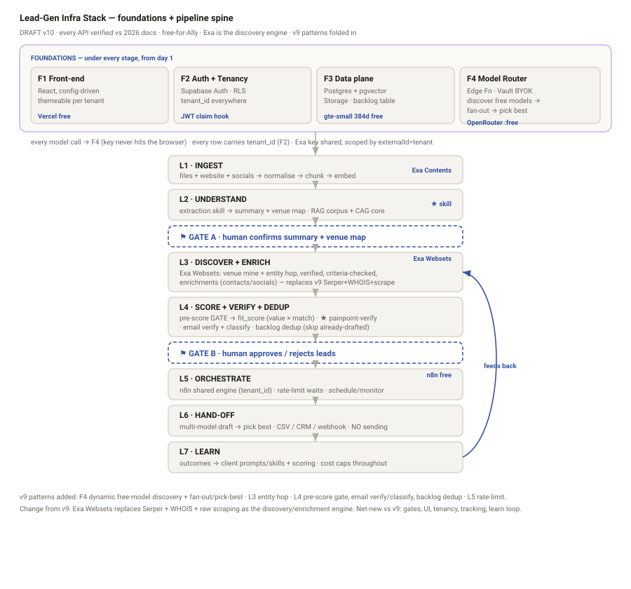

# Infra Stack & Per-Layer "How It's Achieved" — DRAFT

**Status:** 🟡 **DRAFT — PRE-GATE.** Design-level spec. Nothing here authorises a build (see
`STATE.md`). This is the stack the competitor analysis + pipeline critique *imply* but that does
**not yet exist**. It feeds **Mission M2 (verified architecture)**.

**Created:** 2026-06-21 · **Updated:** 2026-06-21 (v10 — folds in the proven **GamersLab
Publisher Outreach v9** n8n pipeline) · **Owner:** Ally · **Campaign:** `gamers_lab_lead_gen`

**What this answers (Ally's ask):** an overview diagram of the end-to-end stack (data →
context → … ), then for **every layer** a table of *how it is achieved* — what **inputs** it
needs, **where from**, what **prompts**, what **skills**, what **tooling**.

**Verification:** every external API named here was checked against **live 2026 docs** on
2026-06-21 (doctrine #4). Verified facts are marked ✅; things that still need M2 line-level
proof or a vendor confirmation are marked ⚠️. Sources at the foot.

**v10 reconciliation with v9:** the running v9 outreach workflow proved several patterns now
folded in — **dynamic free-model discovery + multi-model fan-out/pick-best** (F4),
**venue entity-hop** + **known-set exclusion at source** (L3 — existing prospects are never
re-pulled or re-analysed), **two-stage pre-score gate** + **email verify/classify** (L4), and
**rate-limit waits** (L5). **One deliberate swap:** v9's
**Serper + WHOIS + raw scraping** for web search/identity is replaced by **Exa Websets** as the
discovery/enrichment engine (Exa wasn't on the radar when v9 was built). See §8.

---

## 0. The stack at a glance




Two parts: a **pipeline spine** (the data's journey, top to bottom) sitting on **four
cross-cutting foundations** (present under every stage from day one).

```
┌───────────────────────────────────────────────────────────────────────────────────┐
│  FOUNDATIONS (cross-cutting — under every stage)                                    │
│  F1 Front-end (React, config-driven, themeable per tenant)                          │
│  F2 Auth & Tenancy (Supabase Auth; tenant_id on every row; RLS)                     │
│  F3 Data plane (Supabase Postgres + pgvector + Storage)                             │
│  F4 Model Router (Edge Function: client BYO key [Vault] → OpenRouter free fallback) │
└───────────────────────────────────────────────────────────────────────────────────┘
        │  every model call routes through F4 · every row carries tenant_id (F2)
        ▼
PIPELINE SPINE  (data flows down)

  L1  INGEST ─────────► files + website + socials → normalise → chunk → embed
  L2  UNDERSTAND ─────► extraction skill → structured business summary
                         (value props · ICP · pains · where-customers-are · cold-vs-warm)
                         └─ corpus → RAG (pgvector) · summary → CAG (always-loaded core)
  ──  GATE A (human) ─► user edits/confirms the summary   ◄ highest-leverage quality lever
  L3  DISCOVER+ENRICH ► Exa Websets: EXCLUDE known set at source (never re-pull existing) →
                         venue mine + entity hop; verified + enriched (replaces v9 Serper+WHOIS)
  L4  SCORE+VERIFY ───► only NET-NEW prospects: pre-score gate → two-sided fit_score; email verify/classify
  ──  GATE B (human) ─► user approves / rejects leads in the UI
  L5  ORCHESTRATE ────► n8n shared engine (tenant_id param): enrich · route · schedule · monitor
  L6  HAND-OFF ───────► export CSV / push to CRM / webhook to a sender   (POC does NOT send)
  L7  LEARN ──────────► log outcomes → improve scoring; cost caps + Exa count limits throughout
```

**The 11 "items on the stack"** each get a table below: **F1–F4** (foundations) and **L1–L7**
(spine, including the two human gates). Every table uses the same columns so they're comparable:

| Column | Meaning |
|--------|---------|
| **Inputs** | What this layer consumes |
| **Where from** | The upstream source of those inputs |
| **Prompts / AI calls** | The model work this layer does (all routed via F4) |
| **Skills** | Reusable Claude/agent skills or prompt-packs to formalise (reused for every client) |
| **Tooling / API (✅ verified 2026)** | The concrete services + endpoints |
| **Output / data contract** | What it emits downstream (every record carries `tenant_id`) |
| **Free-tier path** | How it runs at $0 for Ally |
| **Watch-outs** | Verified risks / gotchas |

---

# Foundations (cross-cutting)

## F1 — Front-end

Config-driven React. **No business name in code** — every screen reads a `tenant_config`
(logo, colors, copy). This is the portability mandate made literal.

| | |
|---|---|
| **Inputs** | `tenant_config` (theme tokens + copy); session/JWT; data from F3 via Supabase client; screen state |
| **Where from** | `tenant_config` row in Supabase (F3); Supabase Auth session (F2) |
| **Prompts / AI calls** | None directly — all model work is server-side via F4 (never expose keys in the browser) |
| **Skills** | *Theme/config schema* convention (design tokens per tenant). Optional: a UI-design skill for M3 |
| **Tooling / API** | React + Vite/Next; Tailwind + theming tokens; Supabase JS client; hosted on **Vercel/Netlify free** ✅ |
| **Output / data contract** | User actions → writes to F3 (all stamped `tenant_id`); triggers L1/L3/L5 via Edge Functions or n8n webhook |
| **Free-tier path** | Vercel/Netlify free tier ✅ |
| **Watch-outs** | Never put a model key or `SUPABASE_SECRET_*` in `NEXT_PUBLIC_*`/client bundle. Framework choice deferred to **M3 (UI)**, decision **D7** |

Screens (config-driven, themeable): **Login · Context drop · Guided intake · Review/edit
summary (Gate A) · Review leads (Gate B) · Dashboard.**

## F2 — Auth & Tenancy

POC is single-tenant, **but the schema is multi-tenant from commit 1** so we never retrofit.
Tenancy is a *schema* decision, not an auth feature — cheap now, painful later.

| | |
|---|---|
| **Inputs** | Email/password or Google OAuth; (later) tenant membership records |
| **Where from** | End user; Google Cloud OAuth client; `memberships` table (server-controlled) |
| **Prompts / AI calls** | None |
| **Skills** | *Multi-tenant RLS checklist* (a security pattern doc to reuse per build) |
| **Tooling / API** | **Supabase Auth** (email + Google OAuth ✅, free plan); **RLS** ✅; **Custom Access Token Hook** injects `tenant_id`+`role` into the JWT ✅ (free plan); RLS reads `auth.jwt() ->> 'tenant_id'` ✅; `WITH CHECK` on writes ✅; `RESTRICTIVE` policies ✅ |
| **Output / data contract** | Authenticated session + JWT carrying `tenant_id`/`role`; **every table carries `tenant_id` from day 1** (nullable/defaulted in POC) |
| **Free-tier path** | Supabase free: **50,000 MAU**, social OAuth, custom-claims hook all included ✅ |
| **Watch-outs** | AI-generated RLS is a known breach vector (**CVE-2025-48757** hit 170+ apps via one missing policy). Verify `tenant_id` against a **server-controlled memberships table**, never user-writable `raw_user_meta_data`. Add a **CI cross-tenant isolation test** at productisation. ⚠️ `FORCE ROW LEVEL SECURITY` is valid Postgres but **not** a Supabase-documented recommendation — use on our judgment, don't cite it as endorsed |

## F3 — Data plane

One Supabase project, **shared-schema** (not project-per-tenant — Free allows only 2 projects;
shared schema is also the recommended multi-tenant approach).

| | |
|---|---|
| **Inputs** | Embeddings (vectors); structured rows (summary, leads, scores, outcomes, configs); uploaded files |
| **Where from** | L1/L2 (vectors + summary), L3/L4 (leads + scores), L7 (outcomes), F1 (configs), user uploads |
| **Prompts / AI calls** | None (storage/retrieval only; similarity search via SQL RPC) |
| **Skills** | *Data-model / `tenant_id`-everywhere schema* convention |
| **Tooling / API** | **Postgres**; **pgvector** `vector(N)` ✅ with **HNSW** index (Supabase default) ✅ — ops `<->`/`<#>`/`<=>`, similarity wrapped in an RPC (`match_documents`) ✅; **Storage** for PDFs/docs ✅ |
| **Output / data contract** | Canonical tables: `tenant_config`, `documents`(+`embedding vector`), `business_summary`, `venue_map`, `leads`, `scores`, `known_prospects` (exclusion registry — L3 reads it to never re-pull/re-analyse an existing prospect), `outcomes`, `model_call_log`, `memberships` — all keyed by `tenant_id` |
| **Free-tier path** | Supabase free: **500 MB DB**, **1 GB Storage** (50 MB/file), pgvector at no extra cost ✅ |
| **Watch-outs** | Vector **dimension is fixed per column** — keep it configurable per tenant (gte-small=**384** vs OpenAI 3-small=1536 differ). Free projects **pause after 1 week idle** — needs a keepalive for demos. >2,000-dim embeddings need `halfvec` casting in the index ✅ |

## F4 — Model Router

One server-side interface for *all* model work: try the client's own key, fall back to free.
This is the structural cost advantage the credit-metered incumbents (Clay, White Label Suite,
IRMA) can't match — and it keeps the key out of the browser.

| | |
|---|---|
| **Inputs** | A prompt + model request from any layer; `tenant_id`; the client's encrypted API key (if any) |
| **Where from** | L2/L3/L4/L7 callers; **Supabase Vault** (`vault.decrypted_secrets`, per-tenant key) ✅ |
| **Prompts / AI calls** | This *is* the call path — inject the key server-side and forward. **Two v9-proven patterns:** (1) **dynamic free-model discovery** — query OpenRouter for *currently* `:free` models and filter at runtime (the roster shifts); (2) for quality-critical steps, **fan out the same prompt across several free models and pick the best** response |
| **Skills** | *Model-router contract* (one interface, swappable providers; logs which path was used; optional fan-out + pick-best selector) |
| **Tooling / API** | **Supabase Edge Function** (Deno) proxy ✅ (150s/400s wall-clock; 2s CPU is per-request, async I/O excluded ✅); **OpenRouter** OpenAI-compatible `POST /api/v1/chat/completions` ✅ with native `models[]` **fallback** + `provider` routing ✅; **OpenRouter BYOK** (key-scoping per tenant) ✅ |
| **Output / data contract** | Model completion + a `model_call_log` row (tenant, path used: client-key vs free, tokens, cost) |
| **Free-tier path** | **OpenRouter `:free` models** ✅ (e.g. DeepSeek R1 / Llama 4 Scout / Qwen3 — roster shifts; filter `:free` live). Or GamersLab's own key (their spend) |
| **Watch-outs** | Free OpenRouter = **20 req/min, 50 req/day** until a **one-time $10** purchase lifts it to **1,000 req/day** ✅ — design within this for the POC. Store keys **encrypted in Vault**, never client-side. ⚠️ Vault is the right per-tenant fit but is "a documented option," not a verbatim "the recommended" pattern — our architectural call. Edge Functions **can't** read Vault via env; they query `vault.decrypted_secrets` over the DB connection ✅ |

---

# Pipeline spine

## L1 — Ingest

Turn mixed raw inputs (files **and** URLs **and** social handles — websites/socials aren't
files) into clean, chunked, embedded text. The critique's **Gap 2** fix.

| | |
|---|---|
| **Inputs** | Uploaded files (PDF/docx/txt); the business's website URL; social handles; value-prop notes |
| **Where from** | User upload → **Supabase Storage**; website/socials → the open web |
| **Prompts / AI calls** | Light: optional cleanup/normalisation pass (via F4). Heavy semantic work is L2 |
| **Skills** | *Ingestion-adapter set*: (a) file parse, (b) web crawl, (c) social fetch → all normalise to clean text |
| **Tooling / API** | **Exa Contents API** `POST /contents` ✅ — LLM-ready markdown, handles JS/PDFs, **`subpages`/`subpageTarget` crawl a whole site** ✅, `maxAgeHours` freshness ✅; file parsing in an **Edge Function**; **Supabase `Supabase.ai.Session('gte-small')`** for embeddings (384-dim, **no external API**) ✅ |
| **Output / data contract** | `documents` rows: `{tenant_id, source_type, uri, clean_text, chunk_id, embedding vector(384)}` → RAG store (F3) |
| **Free-tier path** | gte-small embeddings are **free in Edge Functions** ✅; Exa Contents free up to 10 results/search then $1/1000 pages ✅; Storage free ✅ |
| **Watch-outs** | ⚠️ Auth-walled socials (LinkedIn/IG/X) return only public/indexed content — depth varies per platform (unverified). Chunk size/overlap is a quality knob to tune |

## L2 — Understand (RAG + CAG)

The moat. Produce a **structured business summary** that grounds everything downstream — and
split storage correctly: the small editable summary is **CAG** (always loaded), the big corpus
is **RAG** (retrieved on demand). The critique's **Gap 1** decision.

| | |
|---|---|
| **Inputs** | Clean chunked corpus from L1; the user's intake answers; (RAG) retrieved chunks |
| **Where from** | F3 RAG store (vector search); intake form (F1) |
| **Prompts / AI calls** | The **business-context-extraction** prompt → structured summary: value props, ICP/personas, pain points, **where customers are**, **cold-vs-warm channel recommendation** (Gap 7). All via F4 |
| **Skills** | ⭐ **`business-context-extraction` skill** — the single most reused, quality-defining asset; formalise it (turns mixed inputs → the structured summary schema). Pairs with Exa's **Lead-Generation Claude Skill** ✅ for L3 |
| **Tooling / API** | F4 (model) + F3 (pgvector retrieval via `match_documents` RPC ✅). Summary written to a `business_summary` row = the **CAG core** loaded into every later call |
| **Output / data contract** | `business_summary` JSON (value_props[], icp{}, pains[], channels{cold_fit, warm_assets}, where_to_find[]) — **editable**, versioned, `tenant_id`-scoped → **CAG** |
| **Free-tier path** | Free models via F4; gte-small retrieval free ✅ |
| **Watch-outs** | Quality of *everything downstream* is set here. The biggest unknown is GamersLab's *real* ICP and whether cold is even its channel — Gate A exists to surface that, not assume it |

## GATE A — Human review of the summary

Not a passive screen — the **highest-leverage quality lever** (matches the "augmentation beats
autonomous" finding). Keep it; don't drop it.

| | |
|---|---|
| **Inputs** | The L2 `business_summary` (editable) |
| **Where from** | L2 → F1 review/edit screen |
| **Prompts / AI calls** | Optional: "regenerate section" / "suggest ICP refinements" via F4 |
| **Skills** | *Review-UX pattern* (inline edit + confirm + version) — reused at Gate B for leads |
| **Tooling / API** | F1 screen ↔ F3 (writes the corrected summary back, new version) |
| **Output / data contract** | **Confirmed** `business_summary` (the locked CAG core that drives discovery) |
| **Free-tier path** | n/a (UI) |
| **Watch-outs** | Don't let the AI's first draft pass unedited — the confirm step is the point |

## L3 — Discover + Enrich

Find the entities: competitors, lookalike leads/ICP matches, **or** investors — from one
engine. Verified, criteria-checked, source-cited results beat rigid-filter databases for fuzzy
ICPs, and avoid us licensing a contact DB. **This single layer replaces v9's Serper + WHOIS +
fetch/scrape-website + fetch/scrape-contact-page cluster** — Exa's search + criteria +
enrichments + Contents cover discovery, identity, and contact extraction in one verified engine.
Keep v9's **entity-hop** move (mine a proxy, hop to the target — e.g. games → publishers) via
Exa's `scope` relationship/hop-search ✅.

**Exclusion is the FIRST thing this layer does (cost discipline).** Before discovery runs, load
the client's **known-prospects registry** from Supabase and pass it as Exa's **`exclude`** set
(an import of existing prospect URLs). Exa then **never returns prospects we already have**, so
no existing prospect is ever re-fetched, re-enriched, re-verified or re-scored. This is *not*
find-then-dedup — dedup-after wastes exactly the expensive steps (enrich/verify/score/LLM).

| | |
|---|---|
| **Inputs** | The confirmed ICP/summary (CAG); entity type (company/person/investor); count/budget; **the known-prospects exclusion set (from F3)** |
| **Where from** | Gate-A summary (F3); user's discovery request (F1); **`known_prospects` registry (F3)** |
| **Prompts / AI calls** | Build the Webset NL `query` + `criteria[]` (1–5) from the structured ICP — *not* hard-coded — via F4 |
| **Skills** | ⭐ **`websets-query-builder`** (ICP JSON → Webset query+criteria+enrichments + **exclusion import**). Exa's **Lead-Generation Claude Skill** ✅ as the starting template |
| **Tooling / API** | **Exa Websets** ✅ — `POST /v0/websets` (entity: `company`/`person`/`custom`) ✅; **`exclude`** (import of known prospect URLs) to **filter the known set at source** ✅; `criteria` with `evaluations[]` (`satisfied` + cited `references[]`) ✅; **Enrichments** `POST …/enrichments` (text/email/phone/url/number/options) ✅; **`scope` hop-search** (e.g. *investors of* discovered companies) ✅; **`recall`** to pre-size the market ✅; **Monitors** (cron, ≥1/day) for continuous new matches ✅; **Webhooks** (`webset.item.created`/`.enriched`/`webset.idle`) to stream leads in ✅ |
| **Output / data contract** | `leads` rows (**net-new only**): `{tenant_id, entity_type, name, url, enrichments{}, evaluations[] (criteria + cited refs), source}` |
| **Free-tier path** | Exa **$10 onboarding credits**; Websets Free = **1,000 credits / 25 results** ✅ (10 credits = 1 all-green result) |
| **Watch-outs** | **Count auto-stops at 50× requested / 50,000 max** ✅ — a built-in cost guard. ⚠️ Exact 2026 per-call $ price lives at exa.ai/pricing (verify at M2). Multi-tenant: use **`externalId`/`metadata`** = `tenant_id`, or **one API key per client** (per-key rate limits + usage analytics ✅) for clean isolation/attribution |

## L4 — Score + Verify

The **output half** the original sketch was missing (critique **Gap 3**). Competitors win or
lose here. v9 proved two concrete moves now folded in: a **two-stage score** and **email
verify/classify**. **There is no dedup step here** — the known set was already excluded at L3,
so L4 only ever sees **net-new** prospects (re-analysing existing ones would be the expensive
mistake we designed out).

| | |
|---|---|
| **Inputs** | **net-new** `leads` from L3 (known set already excluded upstream); the ICP; (fundraising mode) the 4-dimension rubric |
| **Where from** | F3 `leads` + `business_summary` |
| **Prompts / AI calls** | **Two-stage:** (1) a **cheap pre-score that GATES** expensive enrichment/scoring (don't spend on obvious non-fits); (2) full **two-sided** `fit_score` = value-to-client (fit + timing) × prospect-match — via F4. Exa criteria `evaluations` feed the fit signal |
| **Skills** | ⭐ **`two-sided-scoring` skill** (pre-score gate + customer fit/activity + fundraising 4-dim); **`email-verify-classify` skill** (deliverable? role vs personal?) |
| **Tooling / API** | F4 (model) + F3 (write scores). **Email verify/classify** (v9 step) before outreach. On completion, **write each processed prospect to the `known_prospects` registry (F3)** — that registry is what L3 excludes against next run (the only "dedup" mechanism, and it runs *upstream*) |
| **Output / data contract** | `scores` rows `{tenant_id, lead_id, pre_score, fit_score, dimension_breakdown{}, rationale}`; `leads.email_status`; ranked **net-new** lead list; appended `known_prospects` rows |
| **Free-tier path** | Free models via F4 ✅; pre-score gate *reduces* spend by cutting enrichment volume |
| **Watch-outs** | Generic personalisation gets 1–3% replies; research-grounded gets 10–25% — score on the *grounded* signals, not vanity fields. ⚠️ Pick an email-verification provider at M2 (Exa enrichment can *return* an email; verifying deliverability is a separate call) |

## GATE B — Human review of leads

Mirrors Gate A, for outputs. The human approves/rejects before anything leaves the system.

| | |
|---|---|
| **Inputs** | Ranked, scored, deduped leads + their cited rationale |
| **Where from** | L4 → F1 review-leads screen |
| **Prompts / AI calls** | Optional: "explain this score" / "find more like this" (re-trigger L3 with `exclude`) via F4 |
| **Skills** | *Review-UX pattern* (shared with Gate A) |
| **Tooling / API** | F1 ↔ F3 (accept/reject flags) |
| **Output / data contract** | `leads.status` = approved/rejected; approved set flows to L5/L6 |
| **Free-tier path** | n/a (UI) |
| **Watch-outs** | Keep the cited `references` visible so the human can audit *why* a lead matched |

## L5 — Orchestrate

Wire the stages and run the repeatable/ scheduled work. **n8n as a single shared engine,
parameterised by `tenant_id`** — not instance-per-tenant (critique **Gap 4 / decision D1**).

| | |
|---|---|
| **Inputs** | `tenant_id` + the approved context/leads; schedule/trigger; injected keys (via F4) |
| **Where from** | F1 (webhook trigger) / Gate B; F3 (context); F4 (keys) |
| **Prompts / AI calls** | Any agentic step inside a flow uses n8n's **AI Agent / LangChain** nodes pointed at F4 (OpenRouter via the OpenAI node + custom base URL) ✅ |
| **Skills** | *Template-workflow library* (the "Snapshot" pattern — one parameterised flow, cloned by config) |
| **Tooling / API** | **n8n Community Edition, self-hosted (Docker) — free** ✅; **Webhook trigger** is the entry point (pass `tenant_id` + context in the payload) ✅; native **Supabase / vector-store / AI-Agent** nodes ✅; **Wait nodes for upstream rate limits** (v9 `Wait: Steam Rate Limit`) ✅; idempotent **Upserts** (v9 pattern) |
| **Output / data contract** | Orchestrated runs: enrich → route → schedule → monitor; emits to L6; logs to F3 |
| **Free-tier path** | Self-hosted Docker, $0 ✅ |
| **Watch-outs** | ⚠️ n8n has **no native multi-tenancy** — isolation is *our* job (`tenant_id` on every payload + F2 RLS). ⚠️ The public **REST API cannot directly "execute" a workflow** — must use the **Webhook trigger**; and an API-activated webhook may not register until saved once in the UI ✅ (known 2026 bug). ⚠️ **Don't expose the n8n editor to clients or resell n8n-as-a-service** — that crosses into the paid **Embed** license (third-party-cited ~$50K/yr; not an official list price — confirm with n8n sales). Using n8n as an internal engine stays within the free Sustainable-Use License ✅ |

## L6 — Hand-off

Produce campaign-ready output and hand off. **The POC does NOT send** — deliverability is a
specialist, domain-reputation problem; owning sending = owning the risk of burning client
domains (critique **Gap 3 / decision D3**).

| | |
|---|---|
| **Inputs** | Approved, scored leads + enrichments |
| **Where from** | Gate B / L5 |
| **Prompts / AI calls** | Draft campaign-ready material per lead — **multi-model: fan out across free models via F4 → pick best** (v9 pattern); cites the discovery-pack evidence. *Not* sent |
| **Skills** | ⭐ **`grounded-outreach` skill** (assets cite pack evidence, no fabrication) + *export-adapter set* (CSV; CRM push; webhook to a sender) |
| **Tooling / API** | CSV export (Edge Function / n8n); CRM push (HubSpot/Salesforce/Pipedrive nodes in n8n); outbound webhook to a sender (Instantly/Smartlead/Lemlist) |
| **Output / data contract** | A CSV file (POC) and/or a webhook payload — campaign-ready, never auto-sent |
| **Free-tier path** | CSV export is free ✅ |
| **Watch-outs** | Resist scope-creep into sending. Autonomous send carries reputational/legal landmines (Artisan won't even do AI cold calls) |

## L7 — Learn

Close the loop: did the leads convert? Feed it back to improve scoring, and cap spend so a
client can't accidentally burn credits (critique **Gap 8**).

| | |
|---|---|
| **Inputs** | Outcome signals (accepted/replied/converted); per-run spend |
| **Where from** | CRM/sender callbacks or manual marking (F1); F4 `model_call_log`; Exa usage |
| **Prompts / AI calls** | Periodic "refine scoring weights from outcomes" pass via F4 |
| **Skills** | *Feedback-loop / eval* pattern (outcomes → scoring deltas) |
| **Tooling / API** | F3 (`outcomes` table) + F4 logs + **Exa `GET /v0/teams/me`** concurrency/usage ✅; **per-run cost caps** + Exa **count limits** ✅ |
| **Output / data contract** | `outcomes` rows → updated scoring weights; a cost/usage dashboard view |
| **Free-tier path** | All within free tiers ✅ |
| **Watch-outs** | Cost-cap the run *before* it spends, not after. Cost transparency is a top churn-avoider |

---

## 8. Reconciliation with the live v9 pipeline

`GamersLab Publisher Outreach v9` (n8n, scheduled, ~35 nodes) is the **proven engine for the
back half** of this stack. This spec is the **gated, multi-tenant, learning, Exa-powered shell**
around it.

| v9 node cluster | This stack | Action |
|-----------------|------------|--------|
| Fetch + Filter free OpenRouter models | F4 Model Router | ✅ keep — dynamic free-model discovery |
| LLM: Intel+Draft (all models) → Pick Best | F4 + L6 | ✅ keep — fan-out + pick-best |
| SteamSpy → Pick 100 Publishers → Steam App Details | L3 (venue mine + entity hop) | ✅ keep *pattern*; generalise venue, run hop via Exa `scope` |
| **Serper search · WHOIS · fetch+scrape site/contact** | L3 | 🔁 **replace with Exa Websets** (search + criteria + enrichments + Contents) |
| Pre-Score · Score Relevance (`fit_score`) | L4 | ✅ keep — two-stage gate |
| Verify Email · Classify Email | L4 | ✅ keep |
| Get Drafted IDs · Build/Upsert Backlog | F3 `known_prospects` + L3 `exclude` | ⬆️ reframe — exclude at source (L3), not dedup after (v9 checked late) |
| Wait (rate limit) · Upsert Supabase | L5 + F3 | ✅ keep |

**Net-new vs v9 (the shell):** F1 front-end, F2 multi-tenancy (`tenant_id`/RLS), the two human
**gates**, **config-driven venue mapping** (v9 is hardwired to Steam), **painpoint-as-cited-
evidence** (L4), and the **L7 learn loop**. v9 drafts + stores but does **not** send — matches D3.

---

## Verification status & open decisions

**Verified ✅ (live 2026 docs, 2026-06-21):** Supabase Auth + Google OAuth, RLS, Custom Access
Token Hook, pgvector/HNSW, native `gte-small` embeddings, Edge Function limits, Vault, Storage,
free-tier limits · Exa Websets create/criteria/enrichments/scope-hop/exclude/recall/monitors/
webhooks + 50×/50k auto-stop + Contents subpage crawl · n8n free self-host + webhook trigger +
AI/LangChain nodes + no-native-multitenancy · OpenRouter free models + fallback routing + BYOK.

**Still needs M2 / vendor confirmation ⚠️:** Exa exact per-call $ price (exa.ai/pricing) ·
Exa refresh-monitor request body · Exa social-ingestion depth per platform · n8n exact Embed
$ figure · Vault "recommended" status for per-tenant keys (it's *a* documented option) ·
`FORCE RLS` is valid Postgres but not Supabase-endorsed · Edge Function CPU behaviour under
streaming (live test).

**Open decisions (from `pipeline_critique.md` §5, still Ally's at the gate):** D1 n8n shared
engine vs native orchestration · D7 front-end framework (settled at M3) · embedding dimension
per tenant (gte-small 384 default, swappable).

## Sources (verified 2026-06-21)

**Exa:** websets/api/how-it-works · /create-a-webset · /enrichments · /monitors · /webhooks ·
/imports · events/types · websets/faq · reference/billing · reference/contents-api-guide ·
reference/lead-generation-claude-skill — all under https://exa.ai/docs
**Supabase:** guides/ai/vector-columns · /vector-indexes/hnsw-indexes ·
/ai/quickstarts/generate-text-embeddings · functions/limits · functions/secrets ·
database/vault · auth/social-login/auth-google · database/postgres/row-level-security ·
auth/auth-hooks/custom-access-token-hook · database/postgres/custom-claims-and-role-based-access-control-rbac ·
auth/oauth-server/token-security · storage/uploads/standard-uploads · supabase.com/pricing
**n8n:** docs.n8n.io/embed · /hosting/oem-deployment · /sustainable-use-license ·
integrations/builtin/core-nodes/…webhook · /advanced-ai · …langchain.agent
**OpenRouter:** openrouter.ai/docs/api/reference/limits · /reference/embeddings ·
/guides/routing/provider-selection · /guides/overview/auth/byok · openrouter.ai/models

> Full per-claim source list lives in the three M2 verification briefs (Exa / Supabase /
> n8n+OpenRouter) captured 2026-06-21.
