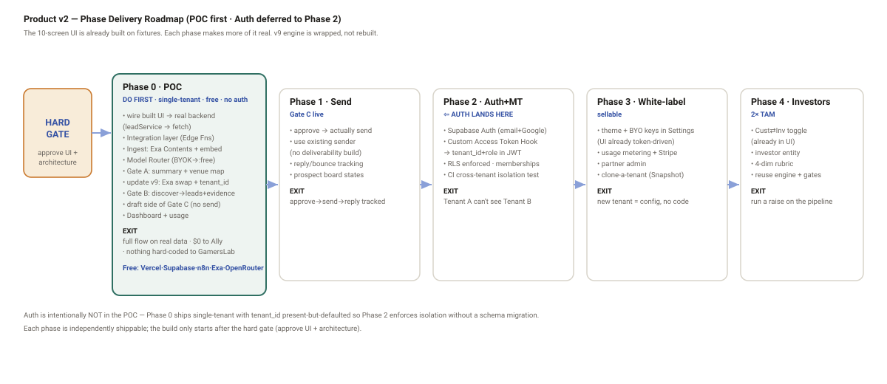

# Product v2 — Phase Delivery Plan — DRAFT

**Status:** 🟡 **DRAFT — PRE-GATE.** The phased build plan for Product Version 2. Pairs with
`architecture_spec_M2_DRAFT.md` (the infra). Nothing here authorises a build until the gate
(`STATE.md`). **POC first. Auth is a later phase.**

**Created:** 2026-06-21 · **Owner:** Ally.

**Premise:** v2 wraps the **already-built UI** (`GamersLab/ui-design/lead-pipeline/`, 10 screens,
`leadService.ts` contract) around the **v9 engine**, via the integration layer. The UI is done and
runs on fixtures; **the work is making each fixture real, endpoint by endpoint.** Phases are
ordered so each one ships something usable and unlocks the next.

---

## Phase 0 — POC (single-tenant, free, no auth) — **DO FIRST**

**Goal:** GamersLab clicks the real product end-to-end — context → Gate A → discovery → Gate B →
drafts — with live data, at $0, nothing hard-coded to "Gamers Lab" in layout.

**Scope:** UI Flows **A + B + the draft side of C**. No auth, no sending, single tenant.

**Build order (each step = make one `leadService` group real):**
1. **Supabase project** (resume/confirm): create the v2 tables (§3 of infra doc); keep v9 `publishers` intact; add `tenant_id` defaulted.
2. **Integration layer skeleton** — Edge Functions implementing `/api/tenant`, `/api/sources`, `/api/intake`, `/api/venues` (the simple reads/writes first). UI flips `leadService` bodies from fixture → `fetch`.
3. **Ingest** — `/api/sources`: Storage upload + **Exa Contents** fetch + `gte-small` embed → `documents`.
4. **Model Router** Edge Function — Vault BYOK → OpenRouter `:free`, dynamic free-model, multi-model pick-best, logs path.
5. **Gate A** — `/api/understanding`: generate summary + venue map (RAG) → editable → confirm.
6. **Update the v9 workflow for v2** — Exa replaces Serper/WHOIS/scrape; stamp `tenant_id`; read enabled venues from `venue_map`; write to `leads`; keep pre-score/budget/email/backlog/multi-model draft.
7. **Gate B** — `/api/discovery/run` triggers n8n (webhook); n8n upserts `leads`+`evidence`; UI polls `runs`; approve/reject (`/api/leads/:id`); `/api/leads/export` (CSV).
8. **Draft side of Gate C** — `/api/outreach` generates grounded drafts (multi-model → pick best) using `cag-block.md`. **No send yet.**
9. **Dashboard + usage meter** — counts, `/api/insights` (seeded), usage from `model_call_log`.

**Exit criteria (POC done):**
- UI runs the full flow on **real** data, not fixtures.
- A discovery run returns verified publisher leads with a **cited evidence dossier** + two-sided score.
- Runs on free tiers / GamersLab keys at **$0 to Ally**.
- **No `"Gamers Lab"` / `"Steam"` hard-coded** — swapping `tenant_config` + venue map = a different client.

**Free-for-Ally:** Vercel/Netlify (UI) · Supabase free (DB/Storage/gte-small) · n8n self-host (existing Sliplane) · Exa free credits · OpenRouter `:free` (+one-time $10 → 1,000/day) or GamersLab keys.

---

## Phase 1 — Outreach send live (Gate C)

**Unlocked by:** POC accepted. **Goal:** approved messages actually send + reply tracking.
**Scope:** wire `/api/outreach/:id/approve` to a real sender (leverage GamersLab's existing path or
a sender like Instantly/Smartlead — **do not build deliverability**), reply/bounce webhooks →
`outreach.stage`, the prospect board (Contacted→Replied→Success→Partial→Lost). Per the design, the
**notification bell** drives Gate-C approvals. **Exit:** a human approves a draft → it sends → reply
state tracked.

---

## Phase 2 — Auth + multi-tenancy (the deferred bit)

**Unlocked by:** a second business wanting in. **Goal:** safe multi-tenant base.
**Scope:** Supabase Auth (email + Google) on the **Sign in** screen; **Custom Access Token Hook**
injects `tenant_id`+`role`; RLS enforced (`auth.jwt()->>'tenant_id'` + `WITH CHECK` + RESTRICTIVE);
server-controlled `memberships`; **CI cross-tenant isolation test**. **Exit:** Tenant A cannot see
Tenant B (test passes); two tenants run on one instance.

---

## Phase 3 — White-label productisation

**Goal:** sellable. **Scope:** per-tenant theming is **already token-driven in the UI** — expose
theme + **BYO model keys** in Settings; usage metering + Stripe billing (usage meter already in UI);
partner admin; "clone a tenant" (Snapshot). **Exit:** onboard a new tenant with **config only, no
code** (the portability acceptance test).

---

## Phase 4 — Fundraising / Investors mode

**Goal:** double the TAM, low marginal cost. **Scope:** the **Customers ⇄ Investors toggle is
already in the UI** (`mode`); add investor entity type + the **4-dimension rubric**
(stage/sector/recency/warm-intro) into scoring; reuse the same engine + gates. **Exit:** a raise can
be run through the same pipeline.

---

## Sequencing & dependencies

| Phase | Depends on | Ships |
|-------|------------|-------|
| **0 POC** | the gate | live single-tenant pipeline, CSV hand-off |
| 1 Send | POC | Gate C sending + tracking |
| 2 Auth/MT | a 2nd tenant | enforced isolation |
| 3 White-label | Phase 2 | billing, theming, clone, admin |
| 4 Investors | engine stable | fundraising vertical |

**Doctrine fit:** POC is the portable template (modular mandate); free-for-Ally holds through POC;
auth deferred exactly as instructed; every external call verified (infra §8); business process
(v10) drives the screens, tech maps onto it.
