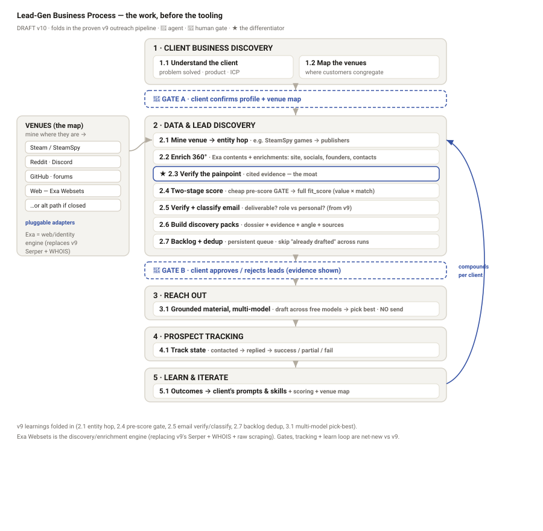

# Business Process Model — Lead-Gen Pipeline (the WHAT, before the HOW)

**Status:** 🟡 **DRAFT — PRE-GATE.** This is the **business-process / value-flow** model. It is
the *first* artifact (doctrine #9: business process before technical). The infra stack
(`how/infra_stack_and_layers_DRAFT.md`) is the **HOW** that hangs off this — it is now
re-sequenced to serve these steps, not the other way round.

**Created:** 2026-06-21 · **Updated:** 2026-06-21 (v10 — folds in the proven **GamersLab
Publisher Outreach v9** n8n pipeline) · **Owner:** Ally · **Source:** Ally's process breakdown +
v9 workflow.

> **Why this exists / what went wrong before:** the first stack I produced was a *technical*
> view that collapsed several distinct business steps into single layers and missed others
> entirely (venue mapping, painpoint verification, discovery packs, prospect tracking). The
> competitor "segments" hid this — e.g. Segment A "find **and** enrich" is two steps; Segment B
> "research **and** personalise **and** send **and** reply" is four. This doc unbundles the
> actual work first.
>
> **v10 update:** reconciled against the real, running **v9 outreach pipeline** (Steam →
> publishers → drafted outreach). v9 proved several concrete steps my first model missed —
> entity-hop mining, two-stage scoring, email verify/classify, backlog dedup, multi-model
> pick-best. Those are now folded in below. **One deliberate swap:** v9 used Serper + WHOIS +
> raw scraping for web search/identity; we standardise on **Exa Websets** as the discovery /
> enrichment engine (it wasn't on the radar when v9 was built).

---

## 1. The process in one line

For a **client**, find the **right prospects**, prove they have the **painpoint the client
solves**, and hand the client **outreach-ready, evidence-grounded leads** — then **learn** what
converts and get better for *that client* over time.

The unit of value is not "a list of contacts." It is **a verified, evidence-backed reason this
specific prospect should care about this specific client** — that is the moat the competitor
analysis says nobody in white-label offers.

---

## 2. The five stages (tool-agnostic)

Each stage: its **goal**, the **real work** (sub-steps), **who** does it (🤖 agent / 👤 human),
**input → output**, and the **decision/gate**.

### Stage 1 — Client Business Discovery  *(understand the client)*
**Goal:** know the client well enough to know who their prospects are and where to find them.

| Step | Work | Who |
|------|------|-----|
| 1.1 | **Understand the client company** — what they actually do, the problem they solve, product/service, value props, who their ideal customer is | 🤖 → 👤 |
| 1.2 | **Map where those customers congregate** — the *venues*. Client-specific and often unusual: Steam for GamersLab; could be Reddit, Discord, GitHub, niche forums, Slack/Discord communities, LinkedIn, industry directories, marketplaces. **Not "generic web."** | 🤖 → 👤 |

**Input:** client site, docs, socials, founder knowledge → **Output:** **Client Profile** +
**Venue Map**. **👤 GATE A:** client confirms both before any mining spends effort.

### Stage 2 — Data & Lead Discovery  *(find + qualify prospects)*
**Goal:** scored, painpoint-verified, outreach-ready leads — not a raw list. **Known prospects
are excluded at source (2.1a), so only *net-new* prospects are ever enriched or analysed** — we
never re-pull, re-enrich, or re-score someone already in the client's store.

| Step | Work | Who | From v9? |
|------|------|-----|----------|
| 2.1 | **Mine the venue, then hop to the entity** — pull candidates from each venue *where accessible*; where closed, **find an alternative path**. Often a two-hop move: mine a *proxy* (e.g. **SteamSpy games**) then **hop to the real target** (the **publisher** behind them). Discord → public community signals, etc. | 🤖 | ✅ proven (games→publisher) |
| 2.1a | **Exclude the known set — at source, FIRST** — before any enrichment, hand the discovery query the client's **already-known prospects** (from Supabase) as an *exclusion list* so they're **never returned**. This is not dedup-after-the-fact: re-analysing an existing prospect wastes the expensive enrich/verify/score/LLM steps. Only net-new prospects flow to 2.2+. | 🤖 | ⬆️ reframed (v9 checked "already drafted" *late* — move it to the front) |
| 2.2 | **Consolidate & enrich each prospect** — 360° profile: company + people, socials, public identity, founder talks / podcasts / interviews, **contact details** | 🤖 | ✅ (was Serper+WHOIS+scrape → now **Exa** enrichments) |
| 2.3 | **Verify the painpoint** — infer & *evidence-check* that the prospect actually faces the problem the client solves. Deep, cited research — **the differentiator**, not list-buying | 🤖 | ⬆️ upgrade (v9 *generates* pain-point intel; we *verify + cite* it) |
| 2.4 | **Score — two-stage, two-sided** — a **cheap pre-score that GATES** expensive enrichment, then a full `fit_score` = value **to the client** (fit + timing) **×** prospect's **match** to the client's product. Rank for *this* client | 🤖 | ✅ proven (pre-score gate + fit_score) |
| 2.5 | **Verify & classify the email** — is it deliverable? is it a *role* address (info@) vs a real person? Gate outreach on it | 🤖 | ✅ proven (Verify + Classify Email) |
| 2.6 | **Build discovery packs** — per-lead dossier: who they are, painpoint evidence, the angle, the sources | 🤖 | new |
| 2.7 | **Maintain the known-prospects registry** — persist every processed prospect with its state (drafted / contacted / …). This registry **is the exclusion list 2.1a reads next run**; its only job is to stop us ever reprocessing. | 🤖 | ✅ proven (Backlog, repurposed) |

**Input:** Client Profile + Venue Map → **Output:** ranked **leads + discovery packs**.
**👤 GATE B:** client approves / rejects leads (with the evidence visible).

### Stage 3 — Reach Out  *(create grounded outreach material)*
**Goal:** outreach assets built on **real information**, never fabricated.

| Step | Work | Who | From v9? |
|------|------|-----|----------|
| 3.1 | **Generate reach-out material, multi-model** per approved lead — draft across several (free) models and **pick the best response**; every asset cites the *real* evidence from the discovery pack (the painpoint, the founder quote, the trigger) | 🤖 → 👤 | ✅ proven (Intel+Draft all models → Pick Best) |

**Input:** approved leads + packs → **Output:** **campaign-ready outreach assets.**
**Boundary (decision D3):** the POC **creates** material; it does **NOT send** — hand off to a
sender. Owning sending = owning the risk of burning client domains.

### Stage 4 — Prospect Tracking  *(track the funnel)*
**Goal:** know the live state of every lead.

| Step | Work | Who | From v9? |
|------|------|-----|----------|
| 4.1 | **Track each lead's state** — not contacted → contacted → replied → success / partial / failure / no-response; capture why | 👤 + 🤖 | ⬆️ v9 backlog tracks *drafted*; **reply/outcome states are new** |

**Input:** outreach + responses → **Output:** **live pipeline / funnel status.**

### Stage 5 — Learn & Iterate  *(get better, per client)*
**Goal:** compound — every cycle improves *this client's* pipeline.

| Step | Work | Who |
|------|------|-----|
| 5.1 | **Learn from outcomes** — what converted vs didn't → feed back into the **client's prompts & skills**, plus scoring weights, the venue map, and painpoint heuristics | 🤖 → 👤 |

**Input:** tracked outcomes → **Output:** **improved client-specific prompts / skills / scoring**
— a *per-client asset that compounds* (and a real switching cost / moat).

---

## 3. What the first (technical) version got wrong

| Ally's business step | In the tech-first stack | Verdict |
|----------------------|--------------------------|---------|
| 1.1 Understand client | L2 "Understand" | ✅ present |
| **1.2 Venue mapping** (Steam/Reddit/Discord…) | buried as a *sub-bullet* "where-customers-are" | ❌ **demoted** — it's a first-class step *and* the hard, unique part |
| 2.1 Mine in correct venues | L3 "Discover" = **Exa Websets only** | ⚠️ **too narrow** — assumed one web engine; real venues need **multiple adapters** |
| 2.2 Consolidate/enrich | folded into L3 | ⚠️ **collapsed** |
| **2.3 Painpoint verification** | implied by Exa "criteria" | ❌ **missing as a step** — no dedicated deep-research "do they actually have the pain" pass |
| 2.4 Score | L4 "Score" — but **one-sided** (fit to ICP) | ⚠️ **half-right** — must be **two-sided** (value to client × prospect match) |
| **2.5 Discovery packs** | — | ❌ **missing** |
| 3.1 Reach-out material | L6 hand-off, marked "*optional*" | ❌ **demoted** — it's a first-class stage, grounded in real info |
| **4 Prospect tracking** | folded into L7 "Learn" | ❌ **collapsed** — it's its own stage |
| 5 Learn → prompts & skills | L7 "Learn" (→ scoring only) | ⚠️ **under-scoped** — must feed back into the client's **prompts & skills**, not just weights |

**Net:** 4 missing/demoted steps, 3 collapsed, 1 too-narrow, 1 half-right. The tech view wasn't
wrong tooling — it was **wrong order**, so the work got compressed to fit the tooling.

---

## 4. Business step → technology mapping (the HOW, now subordinate)

Tech is re-mapped *onto* the confirmed steps. (All verified 2026 — see infra stack doc.)

| Business step | Serving tech (one of several, swappable) |
|---------------|------------------------------------------|
| 1.1 Understand client | Ingestion (files + site via Exa Contents) → `business-context-extraction` skill → editable summary (CAG) |
| **1.2 Venue mapping** | A **`venue-mapping` skill** (ICP → ranked venues + access method per venue). New, first-class. |
| **2.1 Mine venues** | **Pluggable venue-adapter layer**: Exa Websets = the *web* adapter; **+ adapters per venue** (Steam/SteamDB, Reddit, Discord, GitHub, forums). Exa is **one of N**, not the whole layer. |
| 2.2 Consolidate/enrich | Exa enrichments + per-prospect deep research (model via router) |
| **2.3 Painpoint verify** | A **`painpoint-verification` skill** — deep web/social/founder-talk research → cited evidence (satisfied / not / unclear + refs) |
| 2.4 Score (two-sided) | A **`two-sided-scoring` skill** (value-to-client × prospect-match) over the evidence |
| **2.5 Discovery packs** | A **`discovery-pack` template** (dossier: identity + painpoint evidence + angle + sources) |
| 3.1 Reach-out material | A **`grounded-outreach` skill** (assets cite pack evidence; no fabrication). No sending. |
| 4 Tracking | A pipeline/funnel data model + dashboard (Supabase + UI); optional CRM sync |
| 5 Learn | Outcomes → per-client **prompt/skill versioning** + scoring deltas (the compounding asset) |

**Architectural change this forces:** Discovery is **multi-venue**. Design a **venue-adapter
interface** (`find(prospects, venue, access_method)`) so each venue is a config-driven plug-in,
Exa Websets being the default web adapter. This keeps the modular mandate intact (a new client =
new venue map + maybe a new adapter, not a fork).

---

## 4b. What the live v9 pipeline proves (and what's net-new)

`GamersLab Publisher Outreach v9` (n8n, scheduled, ~35 nodes) already runs the **back half** of
this process for real. It is the proven engine; this model is the **gated, multi-tenant,
learning shell** around it.

| v9 node cluster | Maps to | Status |
|-----------------|---------|--------|
| SteamSpy → Pick 100 Publishers → Steam App Details | 2.1 venue mine + entity hop | ✅ keep the *pattern*; generalise venue via the map |
| Serper combined search · WHOIS · fetch+scrape site/contact page | 2.2 enrich | 🔁 **replace with Exa Websets** (search + criteria + enrichments + contents) |
| Score Relevance (`fit_score`) + Pre-Score | 2.4 two-stage score | ✅ keep |
| LLM: Intel + Draft (all models) → Pick Best | 2.3 painpoint intel + 3.1 draft | ⬆️ split intel into a **verify+cite** step; keep multi-model pick-best |
| Verify Email · Classify Email | 2.5 email verify/classify | ✅ keep |
| Get Drafted IDs · Build/Upsert Backlog | 2.1a exclude-at-source + 2.7 registry | ⬆️ reframe — exclude up front, don't dedup late |
| Upsert to Supabase · Wait (rate limit) | F3 store · L5 orchestration | ✅ keep |
| Fetch+Filter free OpenRouter models | F4 model router | ✅ keep (dynamic free-model discovery) |

**Net-new vs v9 (the shell we add):** the two **human gates**, the **front-end/UI**,
**multi-tenancy** (`tenant_id`), **config-driven venue mapping** (v9 is hardwired to Steam),
**painpoint-as-cited-evidence**, and the **tracking + learn loop**. v9 drafts and stores but
does **not** send — consistent with our boundary (D3).

---

## 5. What this means for the UI (where I think it falls short of comprehensive)

The UI must mirror these **five stages as the spine**, with the two human gates as explicit
review screens. From the corrected process, a comprehensive UI needs at minimum:

1. **Onboarding / Client Discovery** — context drop + intake **and** a **Venue Map review**
   screen (confirm/edit where customers are + access method). *(The venue-map screen is the most
   likely omission.)*
2. **Gate A — Confirm understanding** — edit the business summary *and* the venue map.
3. **Lead workspace** — per-lead **discovery pack** view showing the **painpoint evidence + sources**
   and the **two-sided score breakdown** (not just a name/email row).
4. **Gate B — Approve/reject leads** — with evidence visible, bulk + per-lead.
5. **Outreach material** — generated, editable, grounded assets per lead (clearly *not auto-sent*).
6. **Tracking board** — funnel states (contacted/replied/success/partial/failure).
7. **Learn panel** — what's converting, and the per-client prompt/skill improvements over time.
8. **Cross-cutting:** tenant theming, cost/usage meter, source citations everywhere.

**Verdict to pressure-test against your prototype:** if the prototype is a linear "intake →
leads → export," it's likely missing (a) the **venue-map** step, (b) the **painpoint-evidence /
discovery-pack** view, (c) the **two-sided score** breakdown, (d) a real **tracking** board, and
(e) the **learn** loop. I can confirm specifics once I can see the file (it's currently behind a
login — drop the `.dc.html` into the folder or share a screenshot).

---

## 6. Open questions for Ally

1. **Venue adapters for the POC:** for GamersLab specifically, which venues are in scope first
   (Steam + web + Reddit?), and which are "find an alternative path" (no clean API)?
2. **Painpoint evidence bar:** how strong must the evidence be to pass a lead? (e.g. explicit
   public statement vs reasonable inference) — sets the precision/recall trade-off.
3. **Two-sided score weighting:** is "value to client" or "prospect match" weighted higher, and
   does that differ for customer-finding vs fundraising mode?
4. **Tracking ownership:** does the client update lead states manually in our UI, or do we sync
   from their CRM / the sender?
