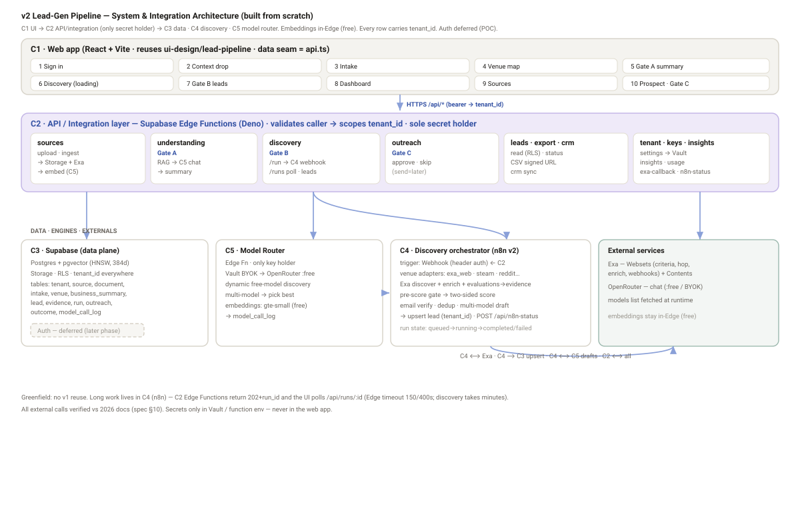
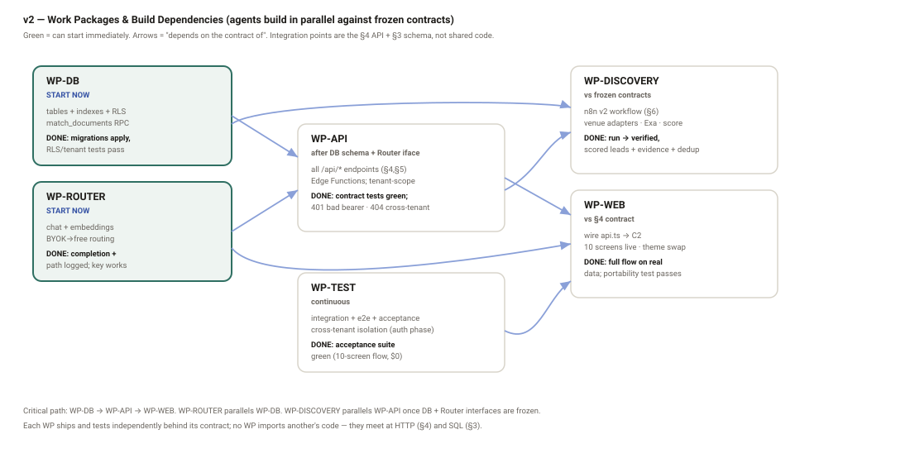
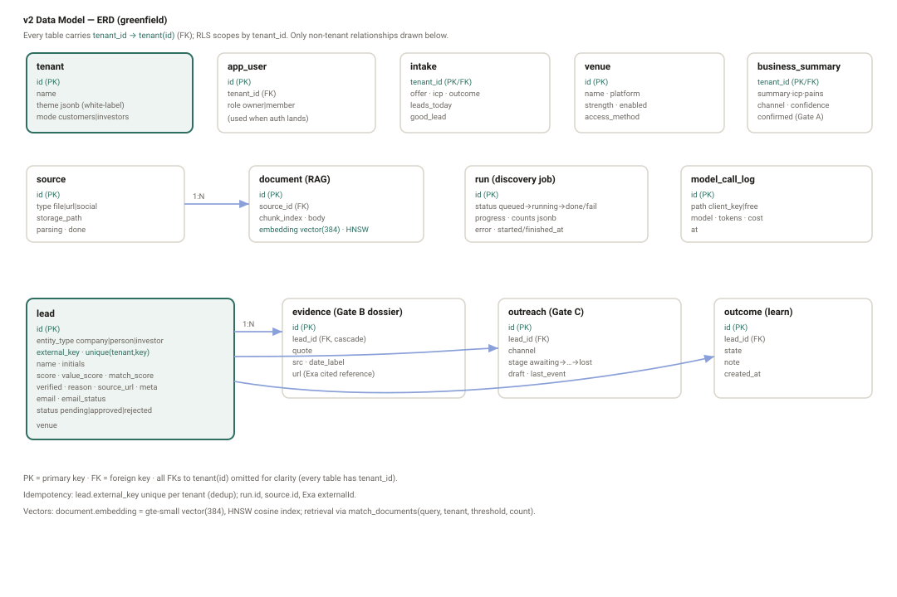

# v2 Lead-Gen Pipeline — Architecture Spec (build-grade) — DRAFT

**Status:** 🟡 **DRAFT — PRE-GATE.** Greenfield architecture for the **v2 lead-gen pipeline**,
specified to a standard where **multiple parallel agents can build, integrate, and test each
module from scratch**. **No v1 dependency** — this system is built fresh; v1 is not referenced,
reused, or migrated. Nothing here authorises a build (`STATE.md`). Pairs with
`v2_phase_delivery_DRAFT.md`.

**Created:** 2026-06-21 · **Owner:** Ally.

**Verification provenance:** every external call in §10 was verified against **live 2026 vendor
docs on 2026-06-21** (exact request/response shapes, auth, limits). Items that could not be
verified verbatim are marked **⚠️ CONFIRM** and must be checked before that line is built.

**How to use this doc (parallel build):** §2 defines independent **work packages (WP)**; each WP
names its inputs, the contract it must implement (from §3 data model + §4 API), and its tests
(§14). Agents can build WPs concurrently against the contracts; integration points are the
HTTP/SQL contracts, not shared code.



---

## 1. System overview

Five runtime components, each independently buildable behind a contract:

| # | Component | Tech | Responsibility |
|---|-----------|------|----------------|
| C1 | **Web app** | React + Vite (existing design system in `poc/ui`) | the 10 screens; calls C2 only |
| C2 | **API / integration layer** | Supabase Edge Functions (Deno) | implements the `/api/*` contract; only holder of secrets; brokers C3/C4/C5 |
| C3 | **Data plane** | Supabase Postgres 15+ (pgvector), Storage | tables, RLS, vectors, files, jobs |
| C4 | **Discovery orchestrator** | n8n (self-host) — a **new v2 workflow** | long-running discover→enrich→verify→score→draft job |
| C5 | **Model router** | Edge Function | provider-agnostic LLM + embedding calls; BYOK→free |

External services: **Exa** (discovery + enrichment + site ingest), **OpenRouter** (LLM). Embeddings
run **in-Edge via `gte-small`** (no external embedding cost).

**Tenancy:** every row carries `tenant_id` from day one. **Auth is deferred** (see §9): the POC
runs single-tenant with a fixed `tenant_id`; auth/RLS enforcement is a later phase but the schema
and policies are written now so nothing is retrofitted.

---

## 2. Module layout & work packages (parallel build units)

```
v2-lead-pipeline/
├── web/                      # C1 — React app (reuse poc/ui)
│   └── src/data/api.ts       #   replaces leadService fixtures with fetch()
├── api/                      # C2 — Supabase Edge Functions (one dir per function)
│   └── functions/{sources,understanding,discovery,leads,outreach,insights,tenant,keys,exa-callback}
├── db/                       # C3 — SQL migrations (schema, RLS, functions)
├── orchestrator/            # C4 — n8n v2 workflow JSON + node code + README
├── model-router/            # C5 — Edge Function (chat + embeddings + routing)
└── tests/                    # cross-module integration + e2e
```



| WP | Owner module | Builds | Depends on (contract) | Done when |
|----|--------------|--------|------------------------|-----------|
| **WP-DB** | `db/` | all tables + indexes + RLS + RPC `match_documents` (§3) | — | migrations apply clean; RLS unit tests pass |
| **WP-ROUTER** | `model-router/` | chat + embeddings + BYOK→free routing (§7) | secrets in Vault | returns completion; logs path; fixture key works |
| **WP-API** | `api/` | every `/api/*` endpoint (§4,§5) | WP-DB schema, WP-ROUTER | contract tests green against §4 schemas |
| **WP-DISCOVERY** | `orchestrator/` | n8n v2 workflow (§6) | WP-DB (writes leads), WP-ROUTER, Exa | a run produces verified, scored leads + evidence |
| **WP-WEB** | `web/` | wire `api.ts` to C2; all 10 screens live | WP-API contract (§4) | full flow runs on real data |
| **WP-TEST** | `tests/` | integration + e2e + acceptance (§14) | all above | acceptance suite green |

WP-DB, WP-ROUTER can start immediately and in parallel. WP-API starts once WP-DB schema + WP-ROUTER
interface are frozen. WP-DISCOVERY and WP-WEB build against frozen contracts in parallel with WP-API.

---

## 3. Data model (greenfield) — DDL, indexes, RLS

All tables in `public`, every row keyed by `tenant_id uuid`. (Verified Supabase SQL — §10.)



```sql
create extension if not exists vector with schema extensions;

create table tenant (
  id uuid primary key default gen_random_uuid(),
  name text not null,
  theme jsonb not null default '{}',          -- white-label token set + logo
  mode text not null default 'customers'       -- customers | investors
);

create table app_user (
  id uuid primary key,                          -- = auth.users.id when auth lands
  tenant_id uuid not null references tenant(id),
  role text not null default 'owner'            -- owner | member
);

create table source (
  id uuid primary key default gen_random_uuid(),
  tenant_id uuid not null references tenant(id),
  type text not null,                           -- file | url | social
  label text not null,
  storage_path text,                            -- for type=file
  parsing boolean not null default true,
  done boolean not null default false,
  created_at timestamptz not null default now()
);

create table document (                          -- RAG chunks
  id bigint generated always as identity primary key,
  tenant_id uuid not null references tenant(id),
  source_id uuid references source(id),
  chunk_index int not null,
  body text not null,
  embedding extensions.vector(384)              -- gte-small
);
create index document_embedding_hnsw
  on document using hnsw (embedding extensions.vector_cosine_ops);
create index document_tenant_idx on document(tenant_id);

create table intake (
  tenant_id uuid primary key references tenant(id),
  offer text, icp text, outcome text, leads_today text, good_lead text
);

create table venue (
  id uuid primary key default gen_random_uuid(),
  tenant_id uuid not null references tenant(id),
  name text not null, platform text, strength text,   -- strong|medium|weak
  note text, enabled boolean not null default true,
  access_method text                                  -- exa_web | steam | reddit | custom_api
);

create table business_summary (                       -- Gate A / CAG core
  tenant_id uuid primary key references tenant(id),
  summary text, icp text, pains text, where_find text,
  channel text, channel_why text,
  confidence jsonb not null default '{}',             -- per-field high|medium|low
  confirmed boolean not null default false,
  version int not null default 1
);

create table lead (
  id uuid primary key default gen_random_uuid(),
  tenant_id uuid not null references tenant(id),
  entity_type text not null default 'company',        -- company | person | investor
  external_key text,                                  -- stable per-entity key for dedup
  name text not null, initials text,
  score int, value_score int, match_score int,        -- two-sided + composite (0-100)
  verified boolean not null default false,
  reason text, source_url text, meta jsonb default '[]',
  venue text,
  email text, email_status text,                      -- deliverable|role|personal|invalid
  status text not null default 'pending',             -- pending|approved|rejected
  created_at timestamptz not null default now(),
  unique (tenant_id, external_key)
);
create index lead_tenant_status_idx on lead(tenant_id, status);

create table evidence (                                -- Gate B dossier (Exa evaluations)
  id uuid primary key default gen_random_uuid(),
  tenant_id uuid not null references tenant(id),
  lead_id uuid not null references lead(id) on delete cascade,
  quote text not null, src text, date_label text, url text
);

create table run (                                     -- discovery job state machine
  id uuid primary key default gen_random_uuid(),
  tenant_id uuid not null references tenant(id),
  kind text not null default 'discovery',
  status text not null default 'queued',              -- queued|running|completed|failed|canceled
  progress int not null default 0,                    -- 0-100
  counts jsonb not null default '{}',                 -- {found, verified, approved}
  error text, started_at timestamptz, finished_at timestamptz
);

create table outreach (                                -- Gate C
  id uuid primary key default gen_random_uuid(),
  tenant_id uuid not null references tenant(id),
  lead_id uuid references lead(id),
  channel text, stage text not null default 'awaiting', -- awaiting|contacted|replied|success|partial|lost
  draft text, last_event text
);

create table outcome (                                 -- learn loop
  id uuid primary key default gen_random_uuid(),
  tenant_id uuid not null references tenant(id),
  lead_id uuid references lead(id), state text, note text,
  created_at timestamptz not null default now()
);

create table model_call_log (
  id bigint generated always as identity primary key,
  tenant_id uuid not null references tenant(id),
  path text, model text, tokens int, cost numeric, at timestamptz default now()
);
```

**RLS** (written now, **enforced when auth lands** — §9). For every tenant-scoped table:
```sql
alter table lead enable row level security;
create policy lead_select on lead for select to authenticated
  using ((select auth.jwt() ->> 'tenant_id') = tenant_id::text);
create policy lead_write on lead for all to authenticated
  using ((select auth.jwt() ->> 'tenant_id') = tenant_id::text)
  with check ((select auth.jwt() ->> 'tenant_id') = tenant_id::text);
```
**RAG retrieval RPC** (verified shape — §10 A1):
```sql
create or replace function match_documents(
  query_embedding extensions.vector(384), p_tenant uuid,
  match_threshold float, match_count int)
returns table (id bigint, body text, similarity float)
language sql stable as $$
  select d.id, d.body, 1 - (d.embedding <=> query_embedding) as similarity
  from document d
  where d.tenant_id = p_tenant
    and 1 - (d.embedding <=> query_embedding) > match_threshold
  order by d.embedding <=> query_embedding asc
  limit match_count;
$$;
```

---

## 4. API contract (C2) — the complete `/api/*` surface

The web app's data seam (`web/src/data/api.ts`) calls only these. All JSON. POC auth: a static
bearer (see §9); production: Supabase JWT. Standard errors: `400` (bad body), `401` (no/invalid
token), `404`, `409` (idempotency), `422` (validation), `500`. Every response is tenant-scoped.

| Method · Path | Request body | Response (200/201) |
|---|---|---|
| `GET /api/tenant` | — | `{tenant:{id,name,theme,mode}, usage:{credits,limit}}` |
| `GET /api/sources` | — | `Source[]` |
| `POST /api/sources` | `{type, label, file?}` | `Source` (`parsing:true`) — kicks ingest |
| `DELETE /api/sources/:id` | — | `204` |
| `GET /api/intake` | — | `Intake` |
| `PUT /api/intake` | `Intake` | `Intake` |
| `GET /api/venues` | — | `Venue[]` |
| `PATCH /api/venues` | `Venue[]` | `Venue[]` |
| `GET /api/understanding` | — | `GateFields` (`{summary,icp,pains,where,channel}` each `{text,conf,why?}`) |
| `POST /api/understanding/generate` | — | `202 {run_id}` (async; writes business_summary) |
| `PUT /api/understanding` | `GateFields` | `GateFields` (sets `confirmed`) |
| `POST /api/discovery/run` | `{mode}` | `202 {run_id}` |
| `GET /api/runs/:id` | — | `{status, progress, counts, error?}` (poll) |
| `GET /api/leads` | `?sort=&verifiedOnly=` | `Lead[]` (incl. `evidence[]`) |
| `PATCH /api/leads/:id` | `{status}` | `Lead` |
| `POST /api/leads/export` | `{ids[]}` | `{url}` (CSV signed URL) |
| `POST /api/crm/sync` | `{ids[]}` | `{synced:int}` |
| `GET /api/outreach` | — | `OutreachItem[]` |
| `POST /api/outreach/:id/approve` | — | `OutreachItem` (POC: stages to `contacted`, **no send**) |
| `POST /api/outreach/:id/skip` | — | `OutreachItem` |
| `GET /api/insights` | — | `DashboardInsights` |
| `POST /api/insights/refinement/apply` | — | `204` |
| `PUT /api/settings/keys` | `{provider, key}` | `204` (→ Vault) |
| `POST /api/exa-callback` | Exa webhook body | `200` (signature-verified) |
| `POST /api/n8n-status` | `{run_id,status,progress,counts}` | `200` |

Field shapes are exactly `web/src/data/types.ts` (`Source, Intake, Venue, GateFields, Lead,
OutreachItem, DashboardInsights`) so WP-WEB is a body-only swap of the fixture service.

---

## 5. Integration layer (C2) — Edge Function specs

Each function: `Deno.serve` handler; verifies caller (POC: static bearer; prod: JWT → `tenant_id`);
reads secrets via Vault (§10 A3); never returns another tenant's rows.

- **`sources`** — `POST`: store file to Storage (`storage.from('sources').upload`, §10 A6) or accept url/social → insert `source(parsing:true)` → enqueue ingest (call C5 embeddings + Exa Contents for url). `GET/DELETE` straight DB.
- **`understanding`** — `POST /generate`: create `run`; retrieve RAG context (`match_documents`) + intake → C5 chat with the extraction prompt → write `business_summary` + per-field confidence. `GET/PUT` straight DB.
- **`discovery`** — `POST /run`: create `run(status:queued)`; POST the n8n v2 webhook (§6) with `{tenant_id, run_id, summary, venues, mode, budget}`; return `{run_id}`. Long work happens in C4.
- **`leads`** — `GET` joins `lead`+`evidence`; `PATCH` status; `export` builds CSV → Storage → signed URL.
- **`outreach`** — `GET` board; `approve`/`skip` update stage (POC: no send).
- **`exa-callback`** — verify `Exa-Signature` (HMAC-SHA256 over `{t}.{rawBody}`, §10 B4) → upsert `lead`+`evidence`.
- **`n8n-status`** — shared-secret header → update `run.progress/status/counts`.

Edge Function limits: 150s (free)/400s (paid) wall-clock, 2s CPU (async I/O excluded), 256 MB — so
all long work is delegated to C4; functions return `202 {run_id}` and the UI polls `GET /api/runs/:id`.

---

## 6. Discovery orchestrator (C4) — new n8n v2 workflow

Triggered by C2 via **Webhook Trigger** (n8n has **no REST execute endpoint** — verified §10 C1).
Webhook secured with **Header auth**; set an explicit `webhookId` on the node (works around the
registration bug fixed ~n8n v2.14 — §10 C1). Respond **Immediately** (202) then run async; post
progress to `POST /api/n8n-status`.

**Node graph (built from scratch):**
1. **Webhook** (header auth) → parse `{tenant_id, run_id, summary, venues, mode, budget}`.
2. **Venue fan-out** — for each enabled venue, a **venue-adapter** sub-branch:
   - `exa_web` → **Exa Websets** `POST /v0/websets` (criteria from `summary.icp`, entity from `mode`, `scope` hop where relevant) (§10 B1).
   - `steam` → SteamSpy `api.php?request=tag` → Steam `appdetails` (⚠️ CONFIRM rate 1 req/s) → entity hop to the company.
   - others (reddit/custom) → adapter stub implementing the same output contract `{external_key,name,url,meta}`.
3. **Enrich** — Exa enrichments `POST /v0/websets/{id}/enrichments` (email/socials/funding) (§10 B3).
4. **Verify (painpoint)** — read Exa item `evaluations[]` (`satisfied`,`references[]`) → write `evidence` rows (§10 B2). This is the dossier/moat.
5. **Pre-score gate** — cheap rules score; drop below floor before any LLM spend.
6. **Two-sided score** — C5 chat → `value_score` × `match_score` → composite `score`.
7. **Email verify/classify** — MX + provider check; set `email_status` (⚠️ CONFIRM provider for scale).
8. **Dedup** — skip `external_key` already in `lead` for this tenant (+ Exa `exclude`).
9. **Draft** — C5 multi-model fan-out → pick best, grounded in `business_summary` (CAG core) → `outreach.draft`.
10. **Persist** — upsert `lead` (`unique(tenant_id, external_key)`) + `evidence`; update `run`.
11. **Status** — `POST /api/n8n-status` at start, per batch (progress%), and on finish/fail.

**Run state machine:** `queued → running → (completed | failed | canceled)`; `progress 0–100`;
`counts {found,verified,approved}`. The UI loading screen polls `GET /api/runs/:id`.

n8n AI nodes available if preferred over raw HTTP: **OpenRouter Chat Model**, **Supabase Vector
Store**, **AI Agent** (§10 C3). License: internal-engine use is permitted under the Sustainable Use
License; do **not** expose the n8n editor to tenants (§10 C4).

---

## 7. Model router (C5)

Edge Function; sole key holder. Order: tenant BYO key (Vault) → else dynamic free model.
- **Discover free models at runtime:** `GET https://openrouter.ai/api/v1/models`; keep where
  `pricing.prompt==="0" && pricing.completion==="0"` (IDs end `:free`). **Do not hardcode IDs — the
  free list rotates** (§10 C2).
- **Chat:** `POST /api/v1/chat/completions`, `Authorization: Bearer …`; body uses `model` + `models[]`
  fallback + `provider{allow_fallbacks,data_collection:"deny"}`; read `choices[0].message.content`,
  `usage` (§10 C1).
- **LLM calls (call-efficient):** default a **single** best free model; **multi-model fan-out only on invalid/low-confidence output** (§11.3), taking the first valid structured JSON. Keeps within 20 req/min · 50/day.
- **Embeddings:** **in-Edge `gte-small`** (`Supabase.ai.Session('gte-small')`, 384-d, free, §10 A2) —
  OpenRouter embeddings exist but are **paid**, so not used for the free path (§10 C... B4 correction).
- **Limits:** free OpenRouter = 20 req/min, 50 req/day → **one-time $10 unlocks 1,000/day** (§10 C3).
- Log every call to `model_call_log` (path, model, tokens, cost).

---

## 8. Ingestion + RAG

`POST /api/sources` (url) → **Exa Contents** `POST /contents` (`subpages`, `text`) (§10 B5) →
chunk (~800 tokens, 100 overlap — tune) → **`gte-small`** embed (384-d, normalized) → insert
`document` rows → HNSW index. Retrieval: embed query → `match_documents(query_embedding, tenant,
0.3, 8)`. Files: parse in-Edge/worker before embedding. (gte-small vectors are unit-normalized, so
inner product `<#>` ranks identically and is cheaper if preferred — §10 A2.)

---

## 9. Auth & tenancy — POC trust model (explicit) + later phase

**POC (auth deferred):**
- Single tenant; a **seed `tenant` row**; `tenant_id` constant injected by C2 from a server-side env
  (`POC_TENANT_ID`), **never from the client**.
- C2 is protected by a **static bearer secret** (`API_BEARER`) the web app sends; Edge Functions
  reject mismatches. RLS exists but isn't the gate yet (single tenant). This removes the prior
  contradiction: in the POC the **integration layer**, not JWT/RLS, is the trust boundary, and it
  hard-pins `tenant_id`.
- No `app_user` rows needed yet.

**Later phase (auth on):** Supabase Auth (email + Google) → **Custom Access Token Hook** injects
`tenant_id`+`role` into the JWT (exact fn + grants, §10 A4) → RLS (§3) becomes the gate (`auth.jwt()
->> 'tenant_id'`) → `app_user`/membership is the server-controlled source of truth → **CI
cross-tenant isolation test** required before any second tenant. Switching on auth changes config +
the C2 auth check only; the schema/policies are already in place.

---

## 10. Verified external-call reference (line-level, 2026-06-21)

### A — Supabase (verified)
- **A1 pgvector / match:** `create index … using hnsw (embedding vector_cosine_ops)`; `match_documents`
  must `order by embedding <=> query_embedding` (not the alias) or the index is skipped. Source: supabase.com/docs/guides/ai/vector-indexes/hnsw-indexes, /vector-columns.
- **A2 embeddings:** `new Supabase.ai.Session('gte-small'); await session.run(input,{mean_pool:true,normalize:true})` → **384-d**. Source: /guides/ai/quickstarts/generate-text-embeddings.
- **A3 Vault:** `select vault.create_secret('val','name','desc')`; read `select decrypted_secret from vault.decrypted_secrets where name=$1` via a `security definer` fn over `SUPABASE_DB_URL`. Source: /guides/database/vault.
- **A4 auth hook:** `public.custom_access_token_hook(event jsonb) returns jsonb`; `claims := jsonb_set(event->'claims','{tenant_id}',to_jsonb(v));` `grant execute … to supabase_auth_admin; revoke … from authenticated,anon,public`. Source: /guides/auth/auth-hooks/custom-access-token-hook.
- **A5 RLS:** `using ((select auth.jwt() ->> 'tenant_id') = tenant_id::text)` + `with check (…)`; `as restrictive` supported. Source: /guides/database/postgres/row-level-security.
- **A6 Storage:** `storage.from(b).upload(path,body,{contentType,upsert})`; `createSignedUrl(path,60)`; use service-role client server-side. Source: reference/javascript/storage-from-upload.
- Free tier (✅ **verified 2026-06-21**, supabase.com docs): **Edge Functions (Deno) included — 500k invocations/mo** · 500 MB DB · 1 GB storage · 5 GB egress · 50k MAU · **2 active projects · pause after ~1 wk idle** (needs keepalive). Edge per-req: 2s CPU, 150s(free)/400s wall, 256 MB, 20 MB bundle.

### B — Exa (verified)
- **B1 create webset:** `POST https://api.exa.ai/websets/v0/websets`, `x-api-key`; body `{search:{query(1-5000),count,entity:{type:company|person|…},criteria:[{description}](1-5),scope:[{source,id,relationship:{definition,limit 1-10}}],exclude:[…]},enrichments:[…],externalId(≤300,409 on dup)}`. Source: exa.ai/docs/websets/api/websets/create-a-webset.
- **B2 item evaluations (dossier):** `item.evaluations[] = {criterion,reasoning,satisfied:"yes|no|unclear",references:[{title,url,snippet}]}`; data under `item.properties.*`. Source: …/items/get-an-item.
- **B3 enrichments:** `POST …/{id}/enrichments {description,format:text|date|number|options|email|phone|url}`. Source: …/enrichments/create-an-enrichment.
- **B4 webhooks:** `POST /v0/webhooks {url,events[1-19]}` → `secret` returned **once**; verify header **`Exa-Signature: t=…,v1=…`**, HMAC-SHA256 over `` `${t}.${rawBody}` ``, timing-safe, reject >300s. Source: …/webhooks/verifying-signatures.
- **B5 contents:** `POST https://api.exa.ai/contents {urls[],text:{maxCharacters},summary:{schema},subpages}`. Source: exa.ai/docs/reference/get-contents.
- **B6 limits:** ~1,000 searches/mo + $10 starter credits (⚠️ CONFIRM exa.ai/pricing). **The "50×/50k auto-stop" is NOT in 2026 docs — do not rely on it; enforce caps yourself via `count` + a per-run ceiling.**

### C — n8n + OpenRouter (verified)
- **C1 n8n trigger:** **no** public REST execute endpoint; use **Webhook Trigger** `https://<host>/webhook/<path>`, methods incl. POST, read `{{$json.body.*}}`; secure via Header/Basic/JWT auth; respond Immediately(202)/last-node/Respond-node/stream. Set explicit `webhookId` (bug fixed ~v2.14). REST API base `/api/v1`, auth `X-N8N-API-KEY` (CRUD+activate only). Source: docs.n8n.io/integrations/builtin/core-nodes/n8n-nodes-base.webhook, /api.
- **C2 OpenRouter models/free:** `GET /api/v1/models`; free = `pricing.prompt==="0"&&pricing.completion==="0"`/`:free`; **list rotates — fetch at deploy.** Source: openrouter.ai/docs/api/api-reference/models.
- **C3 OpenRouter chat + limits:** `POST /api/v1/chat/completions`, `Authorization: Bearer`; `{model,models[],messages,provider{allow_fallbacks,data_collection}}` → `choices[0].message.content`,`usage`. Free: **20 req/min, 50/day; one-time $10 → 1,000/day**. Source: openrouter.ai/docs/api/reference/limits, /chat.
- **C4 OpenRouter BYOK:** add provider key in workspace; 5% fee (waived first 1M/mo); `usage.is_byok`. n8n license: internal engine OK; don't resell/expose n8n. Source: openrouter.ai/docs/guides/overview/auth/byok, docs.n8n.io/sustainable-use-license.

---

## 11. Reliability — failure modes, rate limits, retries, optimization

| Failure | Handling |
|---------|----------|
| Exa search timeout / partial | adapter returns what it has; `run` continues; missing venues logged in `run.error` (non-fatal) |
| Exa item unverifiable (`satisfied:no/unclear`) | lead kept but `verified=false`, low `value_score`; surfaced behind "Verified only" filter off |
| Model returns non-JSON | multi-model pick-best discards; retry next free model (≤4); if all fail, lead persisted without draft |
| OpenRouter 402/429 (free cap) | router falls to next free model; if exhausted, `run` pauses with `error:"model_quota"`; UI shows retry |
| n8n mid-run crash | `run` stuck `running` → C2 marks `failed` after TTL; re-run is safe (idempotent upsert on `external_key`) |
| Duplicate Exa webhook | `exa-callback` upsert is idempotent on `(tenant_id, external_key)` |
| Edge Function timeout on long op | never — all long work is in C4; C2 only enqueues + polls |

Idempotency keys: `lead.external_key`, `source.id`, `run.id`, Exa `externalId`.

### 11.1 Global retry & circuit-breaker policy
- **Every external call** wraps a helper with: explicit timeout (no unbounded waits), **exponential backoff + jitter, max 4 attempts**, honour `Retry-After`/`429`. After max attempts the step fails *non-fatally* where possible (the run continues; the item is dead-lettered with a reason).
- **Per-provider circuit breaker:** after N consecutive `5xx`/`429`, open the breaker for a cooldown; the `run` moves to `paused` with a typed `error` code and is **resumable** (idempotent re-run picks up dead-lettered items).
- **Structured errors:** C2 returns `{error:{code,message,retriable}}`; everything logged with `tenant_id`+`run_id`.

### 11.2 Service constraints & rate limits (VERIFIED — see §10) + backpressure
This is the authoritative table of **every service's hard constraints** and how the build stays inside them.

| Service | Hard constraints (2026) | How we stay inside them |
|---------|--------------------------|--------------------------|
| **OpenRouter** (LLM) | **20 req/min**; **50 :free/day** (→1,000/day after one-time $10); `402` on negative balance; free model list **rotates** | token-bucket in C5 (~≤18/min); on `429`→next free model, then `Retry-After`; on daily exhaustion → `run.paused error="model_quota"` (resumable); **fetch free-model IDs at deploy**, never hardcode |
| **Exa** | per-plan **concurrency** (Pro ~10 concurrent) + per-plan credit/result caps; `409` on duplicate `externalId`; **no documented auto-stop** | C4 caps concurrent websets ≤ plan; **explicit per-run `count` ceiling** (we enforce, not the vendor); backoff on `429`; **⚠️ CONFIRM free-tier concurrency + monthly credits on exa.ai/pricing** |
| **SteamSpy** | **1 req/sec** (1 req/**60s** for `all`); data **refreshes once/day** | 1 req/s throttle (n8n `Wait`); **24h cache** — never re-fetch the same app within a day; ⚠️ CONFIRM ToS for commercial use |
| **Steam Store** (`appdetails`) | unofficial endpoint, informally rate-limited | ≥1s spacing + per-app cache; ⚠️ CONFIRM rate/ToS |
| **Supabase Edge Functions** | **2s CPU/req**, **150s (free)/400s wall**, **256 MB**, **20 MB** bundle, **500k invocations/mo (free)** | all long work in C4; **one function call per user action, not per item**; batch inside the function |
| **Supabase DB (free)** | **500 MB** DB, 1 GB disk (read-only at 500 MB), pooled connections, **pause after ~1 wk idle** | bulk upserts; pooled client; prune old `run`/`model_call_log` rows; **keepalive ping** to avoid pause |
| **Supabase Storage (free)** | **1 GB**, 5 GB egress | store only needed docs; signed URLs expire |
| **n8n** (self-host) | webhook payload **16 MB**; `Wait` doesn't throttle parallel items; **batchSize 1** needed for cross-node refs; no REST execute | reference bulk data by `run_id` (fetch from DB, not payload); batchSize 1 in the enrich loop; explicit `webhookId` (registration bug, fixed ~v2.14) |
| **Embeddings** (gte-small in-Edge) | model fixed at **384 dims**; CPU-bound | batch inputs; embed **once per chunk** (content-hash skip) |

### 11.3 Optimization — do only the work that's needed
- **Pre-score gate before any spend:** cheap rules drop non-fits **before** Exa enrichment or any LLM call.
- **Cross-run dedup:** skip `external_key` already processed (+ Exa `exclude`) — never re-discover or re-draft the same entity.
- **Lazy enrichment:** enrich only leads that pass pre-score, not the whole candidate set.
- **Draft budget:** generate outreach drafts only for top-tier/approved leads within a per-run budget — not every lead (also keeps under OpenRouter caps).
- **Call-efficient LLM (reconciles §7):** **default a single best free model; multi-model fan-out only on invalid/low-confidence output** — not every call (fewer calls, stays under 20/min + 50/day).
- **Caching:** Exa Contents `maxAgeHours` reuse; SteamSpy/Steam 24h cache; embed once per chunk (content-hash); **CAG core** (small `business_summary`) always loaded, **RAG only over the large corpus** with bounded `top-k` (≤8) — don't stuff full docs into prompts.
- **Incremental discovery:** prefer new-only (`exclude` prior runs / Exa monitors) over full rescans; **skip a discovery run** if `business_summary` is unchanged and a recent run exists.
- **Batch, don't loop:** bulk DB upserts; batched embeddings; avoid per-item Edge Function invocations (invocation budget).
- **Async + poll, no busy-wait:** C2 returns `202 {run_id}`; progress via n8n status posts, not repeated polling of Exa.

### 11.4 UI error mapping (the design has per-screen error states)
Discovery quota → "Searching paused — retry"; ingest parse fail → source-chip error; model fail at Gate A → "couldn't generate — retry"; export fail → toast. C2's `{error:{code,retriable}}` drives these.

---

## 12. Security, PII & compliance

- **Secrets:** model/Exa/n8n keys only in **Vault** / function env; never in `web/` or `NEXT_PUBLIC_*`.
- **Tenant isolation:** RLS (§3) + server-pinned `tenant_id`; CI cross-tenant test before multi-tenant (CVE-2025-48757 class).
- **Webhook auth:** verify `Exa-Signature` (B4) and the n8n↔C2 shared secret; reject unsigned.
- **Prompt injection:** scraped page/site content is **data, not instructions** — never concatenate into a system prompt without delimiting; the extraction/draft prompts must treat retrieved text as quoted material.
- **PII (this is a lead-gen tool handling personal contact data):** store only business-contact fields needed for outreach; record `source_url` + date for every contact (provenance); provide tenant-level **delete/export** of a lead + its evidence; set a retention policy on `lead`/`evidence`; outreach drafting must honour suppression/opt-out lists when send lands (Phase 1). **⚠️ CONFIRM** jurisdiction obligations (GDPR/UK-GDPR/CAN-SPAM) with Ally before send is built.

---

## 13. Non-functional / cost

- **Cost (free path):** embeddings free (gte-small); LLM free (OpenRouter `:free`, 1,000/day after one-time $10); Exa on free credits; Supabase + n8n free/self-host → **$0 to Ally** at POC volume.
- **Per-run guardrails:** `budget` (max leads drafted), pre-score floor, explicit Exa `count` ceiling (no reliance on vendor auto-stop).
- **Latency:** discovery is minutes (async + polling, not a blocking request). Simple reads <300ms via PostgREST.
- **Concurrency:** one active `run` per tenant (enforced in `discovery/run`); n8n batch size 1 for cross-node reference safety.

---

## 14. Test strategy (per work package)

- **WP-DB:** SQL unit tests — migrations apply; `match_documents` returns ranked rows; **RLS test**: as tenant A, `select` returns 0 of tenant B's rows (run once auth lands; until then assert tenant-pinned queries).
- **WP-ROUTER:** unit — free-model discovery filters correctly; chat returns content; BYOK path used when key present; logs to `model_call_log`. Mock OpenRouter.
- **WP-API:** contract tests per endpoint vs §4 schemas (status, shape, tenant-scope); negative tests (bad bearer → 401; cross-tenant id → 404).
- **WP-DISCOVERY:** integration — feed a fixed `summary`+`venues`, assert `lead`+`evidence` rows, scores in range, dedup on re-run, `run` reaches `completed` with `counts`. Exa/OpenRouter mocked + one live smoke test.
- **WP-WEB:** e2e (Playwright) — full flow Sign in → Context → Intake → Venues → Gate A edit → discovery loading → Gate B approve → export; theme swap changes only colour (portability test).
- **Acceptance (maps to UI):** the 10-screen flow runs on real data at $0; evidence dossier shows cited sources; two-sided scores render; no `"Gamers Lab"`/`"Steam"` hard-coded.

---

## 15. Env / secrets / config inventory

`API_BEARER` (POC C2 gate) · `POC_TENANT_ID` · `EXA_API_KEY` · `OPENROUTER_API_KEY` (platform fallback) · `N8N_WEBHOOK_URL` + `N8N_WEBHOOK_SECRET` · `N8N_STATUS_SECRET` · `EXA_WEBHOOK_SECRET` · Supabase `SUPABASE_URL`/`SUPABASE_SERVICE_ROLE_KEY` (Edge only) · per-tenant model keys in **Vault** (`tenant_<id>_<provider>_key`). No secret in `web/`.

## 16. Open items / ⚠️ CONFIRM before building those lines
SteamSpy/Steam exact rate limits & ToS; email-verification provider for scale; Exa + Supabase free-tier headline numbers (JS-rendered pricing pages); jurisdictional PII/anti-spam obligations before Phase-1 send; chunk size/threshold tuning; final choice of raw-HTTP vs n8n AI nodes inside C4.
