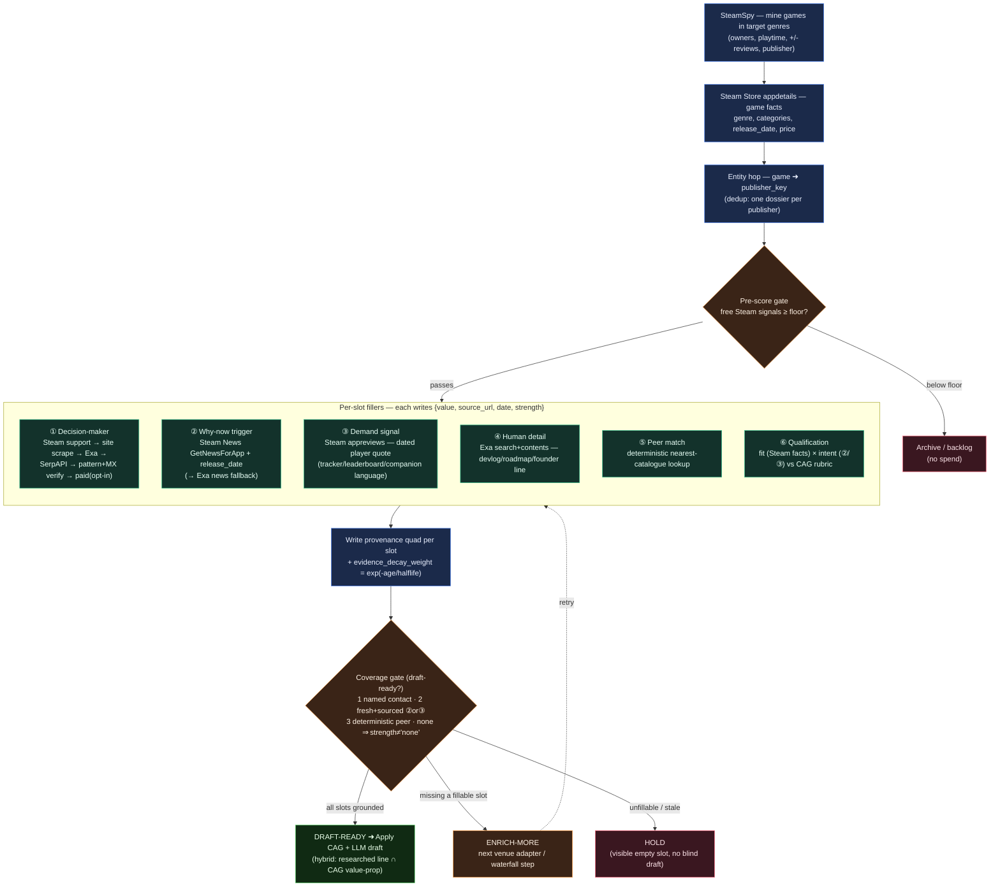

# Prospect Dossier — What We Must Learn to Win a Lead (Research + Template) — DRAFT

**Status:** 🟡 **DRAFT — PRE-GATE.** Research + design only. Nothing here authorises a build (`STATE.md`).
This is the **outward-facing half** of the intelligence model. The inward half (everything true about
*us*) is already designed as the CAG in [`../what/client_intake_design_DRAFT.md`](../what/client_intake_design_DRAFT.md)
and built as [`../gamerslab-poc/docs/cag-block.md`](../gamerslab-poc/docs/cag-block.md). This doc defines
the **prospect dossier**: the per-lead object that says *"these are the slots a lead must fill, with a
source and a date, before we are allowed to draft."*

**Created:** 2026-06-24 · **Owner:** Ally · **Extends:** the personalised cold-outreach work.
**Reads from:** `client_intake_design_DRAFT.md` (Section B = the template's tenant config),
`gamerslab-poc/SPEC.md` §4.1 (real `publishers` columns), `how/pipeline_critique_v2.md` (evidence rubric),
`how/poc_status_review.md` (the empty-drafts incident), `how/contact_enrichment_waterfall_DRAFT.md`.

> Companion visual: **`how/prospect_dossier_steam_intake.svg`** — the technical process by which a Steam
> prospect's dossier is filled (the Mermaid source is embedded in §9 below).

---

## 1. The frame: two mirror objects, one join

A winning email is the **join of two objects**, not one blob:

- **Client CAG** — everything true about *us* (GamersLab). Composed **once** from the intake bank, reused
  for every lead. *This half exists.*
- **Prospect dossier** — everything we must learn about *them*. Defined **once as a template**, then
  **filled per lead**. *This half does not exist as a structured object today* — the pieces are scattered
  across ad-hoc `publishers` columns (`evidence_quote`, `pain_signal`, `contact_name`, `peer_publisher_ref`)
  with no schema that gates drafting.

> **The winning email = our proof ∩ their need, anchored on a fresh, verifiable trigger.** You cannot
> reliably manufacture that intersection if either side is freeform. The research below shows *why* the
> intersection is the whole game, and the template encodes *what* must be in it.

### The key move: the dossier template is *derived from* the CAG, not invented

What we go looking for on a prospect is dictated by what the client can prove and offer. GamersLab sells
community tooling, so the template asks *"is there player demand for trackers/leaderboards? what's the
launch window? which catalogue peer matches?"* A localisation client would get a **different** template
(*"what languages do they ship? reviews complaining about translation?"*). So:

> **The dossier template is the CAG pointed outward:** given what we sell, here is the minimum we must
> learn about any prospect to prove we are relevant — *right now*.

This is also what keeps it modular (mandate #7): the **template** (which slots) is **tenant config**; the
**fillers** (Steam reviews, news, socials, search) are **venue adapters**. Built this way, a new client or
a new venue *extends the template* instead of deepening the Steam coupling.

---

## 2. What the research says actually wins business

Eight findings from 2025–2026 sources (full list in §11). They converge hard, and every one of them maps
to a design decision in the template.

### 2.1 The deal is timing, not just fit — the **Fit × Intent × Timing** model

The current industry consensus scores a prospect on three multiplied axes, not one:

- **Fit** — structural: are they the kind of org we should ever sell to (firmographics, technographics,
  persona, ICP)?
- **Intent / Trigger** — has something *changed* that creates a need or budget?
- **Timing / Recency** — how fresh is that change; are we inside its window?

Gartner's finding anchors the whole approach: **99% of B2B purchases are triggered by a specific
organizational change.** Detect the trigger and you get on the shortlist *before* the formal evaluation
starts. Fit alone is a list; fit × intent × timing is a *prioritised, in-window* list. This is exactly the
`fit` vs `intent` separation already designed into the intake (Section B1 vs B3), now made a per-lead
scored object.

### 2.2 Trigger events are **facts**, not vibes — verifiable, timestamped, sourced

The literature draws a sharp line: a **trigger event** is "a discrete, timestamped, *verifiable* business
change" — a funding round, a new exec, a product launch, a patch, a public complaint — *with a source URL
and a date*. This is distinct from **intent data** (probabilistic, inferred from browsing) and from
**firmographics** (static). The operative property for us: **a trigger has a source and a date or it is
not a trigger.** That property is the spine of the provenance model in §4.

Triggers also **decay**, on a clock that depends on the event:

| Trigger class | Useful window (typical) |
|---|---|
| Funding round | strong for ~2–4 weeks, useful ~90 days |
| New VP / exec hire (incl. a champion's job change) | ~30–90 days |
| Product launch / major patch | days–weeks around the date |
| Pricing-page / pain-post velocity | ~5–10 days |

"Signals that have aged past their window are dead data." → the dossier stores a **date per slot** and a
**decay weight** (the repo already has `evidence_as_of` + `evidence_decay_weight`).

### 2.3 The personalization that works is **one specific, sourced, recent detail** — and accuracy is a *prerequisite*

This is the single most important finding for the gate. Multiple independent 2026 studies show a
**step-function**, not a smooth curve:

| Personalization tier | Reply rate (representative) | Source |
|---|---|---|
| No personalization | 2.1% | Warmysender (25k campaigns) |
| First name only | 2.6–3.4% | Warmysender / Gangly |
| + company merge fields | 4.4–5.8% | Gangly / Warmysender |
| **One researched, specific line** | **7.8–9.3%** | Gangly / Warmysender |
| **Signal-led (real trigger)** | **11.2–19.4%** | Gangly / Prospectory (11k emails) |

Two hard caveats that *define* the template:

1. **Mail-merge alone is a trap.** A 4.2M-email study (Lavender) found emails with *only* first-name +
   company tokens performed **12% worse than no personalization at all** — the tokens act as a
   "this is automated" flag. So "personalised" without a real, specific detail is *negative* value.
2. **Incorrect personalization is worse than none.** Warmysender measured incorrectly-personalised emails
   (wrong name, stale title, factual error) at **0.84%** — below the no-personalization baseline.
   *"An accurate generic email outperforms an inaccurate personalized one."* And: *"if the rep cannot
   point to the source, it does not count"* — references must be from roughly the **last 14 days**.

> **Design consequence:** the value of a draft is *capped by the accuracy and freshness of the dossier
> slot it cites.* An ungrounded slot doesn't just add nothing — it makes the email worse than a generic
> one. This is the empirical case for the coverage gate (§5): no draft unless the cited slots are sourced
> and dated.

The same studies show the winning *architecture* is a **hybrid**: one or two researched, recipient-specific
sentences sitting on top of a templated value-prop and CTA (the highest ROI per minute in all of cold
outbound). That hybrid **is** our model — the researched line comes from the **dossier**, the templated
value-prop/CTA comes from the **CAG**. The two-object design is not a convenience; it is the empirically
optimal structure.

Also load-bearing for keeping the dossier *small*: **one to two specific details is optimal; three or more
reduces reply rates ~15%** (feels intrusive). This is the evidence for a *minimum-viable* dossier, not a
full intel file — over-collection both burns the free-tier budget and *hurts* the email.

### 2.4 Getting to the decision-maker early is the biggest single lever

Ebsta/Pavilion's 2025 benchmark: **early decision-maker involvement lifts win rates by 55%; delayed
engagement cuts them by 113%.** Enterprise accounts have an **8–12 person buying committee**; the useful
roles to tag are **decision-maker / influencer / champion / blocker**. The single highest-converting
trigger of all is a **champion changing jobs** (your existing advocate lands at a new company). → the
dossier's **Decision-maker** slot wants a *named person + role + channel*, not a role inbox. The repo's
own data shows why this matters: today **87% of outreach goes to generic Steam support; only 7% of rows
have a human name** (`poc_status_review.md` D8). That gap is the funnel's last-mile failure.

### 2.5 Enrichment is a **field taxonomy filled by a waterfall**, not a single lookup

Apollo, Clay, and ZoomInfo all model enrichment as four field categories, filled in tiers:

| Category | Fields | GTM function | Tier |
|---|---|---|---|
| **Contact identity** | name, verified email, direct dial, title, seniority, dept | contactability + personalization | routing-critical |
| **Firmographic** | size, industry, revenue, HQ, stage, domain | ICP match + routing | scoring-critical |
| **Technographic** | tech stack, platforms, tools | fit + relevance hooks | scoring-critical |
| **Intent / behavioral** | buying-intent topics, job changes, funding, news, web behavior | **timing + prioritization** | personalization |

Critically, contact data is filled by a **waterfall**: query provider A; if it returns an unverified/
catch-all result, fall through to B, then C, until a *verified* result is found — **per field**. This is
exactly the design already drafted in `contact_enrichment_waterfall_DRAFT.md` (Steam API → site scrape →
search → pattern-guess + MX verify → paid, opt-in). The dossier formalises *what* each slot needs; the
waterfall is *how* one slot (contact) gets filled.

### 2.6 Synthesis — the levers, ranked

1. A **fresh, sourced trigger** (why-now) — the #1 relevance lever; 3–5× reply lift.
2. A **demand signal in the prospect's own words**, dated — the highest-converting personalization.
3. A **named decision-maker** + channel — the biggest win-rate lever once you're in.
4. A **deterministic peer match** — catalogue-relevant proof ("a game like yours is already here").
5. A **human detail to mirror** (devlog/roadmap/founder line) — proof-of-homework.
6. **Two-sided qualification** — right-prospect targeting, and the disqualifier that saves spend.

Every lever is **only as good as its provenance.** That is the whole reason the template carries a source
and a date on every slot.

---

## 3. The template — a minimum-viable dossier (6 slots + a relationship strip)

Keep it tight: **six per-lead slots**, plus a **relationship/suppression strip** that lives on the
*entity* (the publisher), not the per-game row. Each slot carries its own provenance quad
`{value, source_url, date, evidence_strength}`.

| # | Slot | Question it answers | Research lever (§2) | Maps to intake item |
|---|---|---|---|---|
| 1 | **Decision-maker** | Who do we actually email — named person, role, channel? | §2.4 win-rate lever | B4 / contact-type |
| 2 | **Why-now trigger** | What changed recently that makes them ready *now*? (launch/patch/news/review-spike, dated) | §2.1–2.2 #1 relevance lever | B3 trigger/intent |
| 3 | **Demand signal** | Do their players/users *ask* for what we offer, in their own dated words? | §2.3 highest-converting personalization | B3 painpoint evidence |
| 4 | **Human detail** | One devlog/roadmap/founder line we can mirror as proof-of-homework | §2.3 "researched line" | A4 voice / B3 |
| 5 | **Peer match** | The deterministic nearest catalogue peer + the offering it proves | §2.6 catalogue-relevant proof | A3 peers / B1 |
| 6 | **Qualification** | Two-sided fit + the rationale (and any disqualifier) | §2.1 fit; §2.5 firmographic | B1 fit / B2 disqualifiers |

**Relationship / suppression strip (entity-level, not per row):** touch log (last contacted, channel,
outcome), journey stage (new / contacted / replied / won / lost), and **do-not-contact / already-customer**
suppression. This is what stops us re-emailing a live conversation or a known customer, and it is keyed on
the **publisher entity**, not `steam_app_id` (a known gap — see §6).

---

## 4. Provenance model — the property that makes "verifiable" enforceable

Every slot value is a quad, never a bare string:

```
slot := {
  value:             "<the fact / quote / name>",
  source_url:        "<where it came from>",     // required; no URL ⇒ slot is empty
  date:              "<YYYY-MM-DD>",              // required; drives recency decay
  evidence_strength: explicit | inferred | none  // the rubric below
}
```

- **evidence_strength** uses the rubric already live in the repo (`pipeline_critique_v2` D1):
  `explicit` (a cited public statement), `inferred` (reasonable read of public signals), `none`.
  The resolved evidence bar (intake B3.32): a slot passes on **≥1 cited explicit signal OR ≥2 corroborating
  inferred signals.**
- **Recency decay**: `date` feeds `evidence_decay_weight = exp(-age_days / halflife)` (already a column),
  with the half-life set per trigger class (§2.2). A true-but-stale trigger is down-weighted, not used as
  if fresh — the literature's "dead data" rule.
- **A slot with no `source_url` or no `date` is *empty by definition*, regardless of whether a `value`
  string exists.** This is what turns "verifiable" from an adjective into a check.

---

## 5. The coverage gate — the template only earns its keep if it gates drafting

The template is worth building **only** because it can block a draft. Today the engine drafts blind and
fails: of the 115 rows that are *supposed* to draft, **only 29 have a body — a ~75% empty-draft rate** —
and there is no gate on evidence (`poc_status_review.md` D1). §2.3's accuracy finding says those blind
drafts are not merely wasted calls; when they *do* cite a stale or wrong detail they produce emails worse
than generic ones.

**Draft-ready rule (a lead may be drafted only when all hold):**

1. **Slot 1 grounded** — a *named* decision-maker with a channel (not a bare role inbox), OR an explicit
   tenant-config exception.
2. **At least one fresh + sourced trigger or demand signal** — Slot 2 **or** Slot 3 with `source_url`,
   `date` within window, and `evidence_strength ≠ none`.
3. **A deterministic peer** — Slot 5 resolved (this is computable from the catalogue, so it should almost
   always pass; failing it is a config smell).

Otherwise → **route to enrich-more** (try the next venue adapter / waterfall step) **or hold**. **No draft
on `evidence_strength = 'none'`.** This is the generalised form of the gate already recommended in the
status review, and it flips the failure mode: an empty slot becomes **visible** ("no fresh trigger found")
so we either fill it or stop — instead of spending a model call pretending.

> One reuse note: this is a **schema over the existing lead entity** (and the provisioned v2 structured
> tables), **not a new silo.** Several columns already exist scattered (§6). The template is what turns
> them into a coherent *required set with provenance and a gate.*

---

## 6. Mapping to the live `publishers` table — what exists, what's a gap

The dossier is mostly a **reinterpretation of columns that already exist**, plus a few real gaps.

| Slot | Existing `publishers` columns (reuse) | Gap to close |
|---|---|---|
| 1 Decision-maker | `contact_name`, `contact_role`, `contact_email`, `contact_source`, `email_valid`, `email_status`, socials (`twitter_handle`, `linkedin_company_url`, `discord_url`) | named-person coverage (today 7%); per-contact provenance |
| 2 Why-now trigger | *(partial)* `release_date`, `coming_soon`, `game_phase` | **no dedicated `why_now` value + source_url + date**; no news/patch fetch |
| 3 Demand signal | `pain_signal`, `evidence_quote`, `evidence_sources`, `evidence_as_of`, `evidence_strength`, `intel_quality` | already the best-formed slot — just needs the gate to *require* it |
| 4 Human detail | `founder_name`, `founder_quote`, `founder_quote_source` | date field; broaden beyond "founder" to devlog/roadmap |
| 5 Peer match | `peer_publisher_ref`, `pitch_angle`, `best_ugc_app` | make it **deterministic** (nearest-catalogue), not LLM-guessed |
| 6 Qualification | `pre_score`, `fit_score`, `value_score`, `match_score`, `score_rationale`, `recommended_action`, `risk_flags`, `reject_reason_code` | two-sided score is proxied today (SPEC §8 V1-GAP) |
| Relationship strip | `pipeline_status`, `sent_at`, `replied_at`, `reviewed_by`, `outreach_thread_id` | **keyed on `steam_app_id`, not the publisher entity** (critique I3) — re-contact risk |

Net: the dossier is ~70% **already provisioned** in columns; the work is (a) a real **`why_now`** slot with
provenance, (b) **named-contact** coverage, (c) **deterministic peer**, (d) **entity-level** relationship
strip, and above all (e) the **gate** that makes the quad mandatory.

---

## 7. Modularity proof — same template, different client

The template (the six slots) is **tenant config**; the **fillers** are venue adapters. Swap the client and
only the *filler queries and the evidence definitions* change — the slots and the gate do not.

| Slot | GamersLab filler (Steam venue) | Localisation-client filler (different venue) |
|---|---|---|
| Why-now trigger | Steam release date / `coming_soon` / news (patch) | Steam/console **launch in a new region**; "coming soon" in new languages |
| Demand signal | Steam reviews asking for trackers/leaderboards | Steam reviews complaining about **translation / missing language** |
| Peer match | nearest catalogue game by genre + UGC offering | nearest **localised title** we shipped in that language |
| Decision-maker | publisher BD/CEO via site/socials | same discovery, same waterfall |
| Qualification | "has PvP/leaderboards, 1–15 team, growth phase" | "ships text-heavy game, no localization team, EFIGS gap" |

Same machine; new answers, not new questions — the same portability proof the intake bank passes
(`client_intake_design_DRAFT.md` §6).

---

## 8. Steam fillers — which call fills which slot (the venue adapter)

Verified against 2026 Steam surfaces (§11). All free; the live v10 engine already calls most of these.

| Slot | Primary filler (free) | Fallback(s) | Writes |
|---|---|---|---|
| Discovery (pre-slot) | **SteamSpy** `all`/`genre` → mine games, owners, playtime, pos/neg reviews, publisher/developer | — | identity + `publisher_key` (game→publisher hop) |
| Game facts | **Steam Store** `appdetails` (genres, categories, release_date, price, description) | — | `primary_genre`, `steam_tags`, category flags, `game_phase` |
| 1 Decision-maker | Steam `support_info.email`; then **site scrape** → **Exa search** (→ SerpAPI fallback) → **pattern-guess + MX verify** → **paid (Hunter/Apollo, client key, opt-in)** | socials | `contact_*`, `email_valid` + source_url/date |
| 2 Why-now trigger | **Steam News** `GetNewsForApp` (patch/launch posts, dated) + `release_date`/`coming_soon` | Exa news search on studio | `why_now` value + source_url + **date** |
| 3 Demand signal | **Steam Reviews** `appreviews/<appid>?json=1` (filter for tracker/leaderboard/companion language; quote + date) | community/Discord mention via Exa | `evidence_quote`, `evidence_sources`, `evidence_as_of`, `evidence_strength` |
| 4 Human detail | **Exa** search+contents over studio site/devblog/interviews; Steam developer posts | founder talks (RAG later) | `founder_quote` (+ source + date) |
| 5 Peer match | **Deterministic** nearest-catalogue lookup (genre/feature vector vs the 6 platform games) | — | `peer_publisher_ref`, `pitch_angle`, `best_ugc_app` |
| 6 Qualification | computed from Steam facts (fit) × demand/trigger (intent) vs the **CAG rubric** | — | `fit_score`, `value_score`/`match_score`, `score_rationale`, `risk_flags` |

> **Provenance rule applies to every cell:** a filler that returns a value without a resolvable URL + date
> writes the slot as *empty* (`evidence_strength='none'`), which the gate (§5) then blocks.

---

## 9. The technical process — how a Steam prospect's dossier gets filled

Embedded Mermaid source (rendered to `how/prospect_dossier_steam_intake.svg`). It shows the venue mine →
entity hop → pre-score gate → per-slot fillers (each writing the provenance quad) → **coverage gate** →
draft-ready / enrich-more / hold.



Read it as: **nothing is drafted until the gate passes**, and an empty slot is *surfaced* ("no fresh
trigger found") rather than silently producing a hollow email — the direct fix for the 75% empty-draft
failure, and the enforcement of §2.3's "accuracy is a prerequisite."

---

## 10. What this unlocks + open questions for Ally (gate)

**Unlocks.** It converts the scattered enhancement items (#1 demand signal, #2 why-now, #3 human detail,
#4 peer, #9 decision-maker) from *separate passes* into **fillers for one schema with one gate** — a single
target to build against instead of loosely-coupled passes. It makes "verifiable" *enforceable* (URL + date
or the slot is empty), and it is the natural backing object for the planned **second intake page** about
prospect data (deliberately out of scope here, per your note).

**Open questions (pre-gate):**

1. **Slot count** — confirm the **six** are right, or add/drop one (e.g. is "human detail" worth a slot, or
   fold into demand signal to stay at five and protect the ≤1–2-details rule)?
2. **Gate strictness** — require a *named* contact (precision, smaller funnel) or allow a role inbox with an
   explicit trigger (recall)? Tunable, but pick the default.
3. **`why_now` storage** — add a first-class `why_now {value,url,date}` to `publishers` now, or wait for the
   v2 structured tables (SPEC §4.2)?
4. **Relationship strip re-key** — move suppression/touch-log from `steam_app_id` to the **publisher
   entity** (closes the re-contact gap I3)? This is a small migration with outsized safety value.
5. **Next artifact** — turn this into (a) the concrete **slot schema + gate rule as a build spec**, (b) the
   **second intake page** design, or (c) wire the gate into the v10 draft step first?

Nothing is built. Awaiting your gate.

---

## 11. Sources

Personalization & reply-rate evidence:
- Warmysender — *Cold Email Personalization Study (25,000 campaigns)*, 2026 — https://warmysender.com/blog/posts/cold-email-personalization-impact-study-reply-rates
- Gangly — *We Analyzed 500 B2B Cold Emails*, 2026 — https://getgangly.com/blog/cold-email-reply-rate-study
- Prospectory — *Signal-vs-Template Breakdown (11k emails; cites Lavender 4.2M)*, 2026 — https://prospectory.ai/resources/signal-based-cold-email-reply-rates/
- Allston Labs — *Cold Email Personalization at Scale (the hybrid optimum)*, 2026 — https://allstonlabs.com/library/copy/personalization
- CopyCrest — *State of Cold Email (65M emails; Woodpecker 142%, Backlinko 32.7%)*, 2026 — https://copycrest.com/research/state-of-cold-email
- Martal — *B2B Cold Email Statistics 2026* — https://martal.ca/b2b-cold-email-statistics-lb/

Triggers, buying signals & intent:
- Autobound — *Sales Trigger Events: 2026 Playbook (trigger = timestamped, verifiable, sourced)* — https://www.autobound.ai/guides/sales-trigger-events
- Reachly — *What Are Buying Signals (cites Gartner 99%)*, 2026 — https://www.reachly.co/blogs/what-are-buying-signals-the-complete-2026-b2b-guide-with-signal-stack-examples-and-playbooks
- Explorium — *B2B Buying Signals (relevance × recency; decay)*, 2026 — https://www.explorium.ai/blog/data-for-gtm/b2b-buying-signals/
- Leadfeeder — *Buying Signals (Fit + Opportunity + Intent)*, 2026 — https://www.leadfeeder.com/blog/intent-data/buying-signals/
- Getcleed — *Sales Signals guide (signals vs intent vs triggers)*, 2026 — https://www.getcleed.com/blog/sales-signals-guide
- ZoomInfo — *15 B2B Buying Signals*, 2026 — https://pipeline.zoominfo.com/sales/b2b-buying-signals

Account intelligence, buying committee & enrichment schema:
- Demandbase — *B2B Buying Committee* — https://www.demandbase.com/faq/b2b-buying-committee/
- Salesmotion — *MEDDPICC* / *Account Prioritization* — https://salesmotion.io/blog/meddpicc-sales-methodology
- Apollo — *What Fields Can Be Auto-Enriched (4 categories, tiers)* — https://www.apollo.io/insights/what-fields-can-be-automatically-discovered-and-enriched-for-a-lead
- Clay — *Data Enrichment Guide: Fields & Waterfall (2026)* — https://www.devcommx.com/blogs/clay-data-enrichment-fields-integrations-guide
- ZoomInfo — *Lead Enrichment Tools (per-field waterfall)* — https://pipeline.zoominfo.com/sales/lead-enrichment-tools
- Caelian — *ZoomInfo vs Apollo vs Clay (2026)* — https://caelian.ai/blog/zoominfo-vs-apollo-vs-clay

Steam data surfaces (filler verification):
- Steamworks — *User Reviews: Get List (`appreviews`)* — https://partner.steamgames.com/doc/store/getreviews
- SteamSpy dataset (owners/playtime/reviews/publisher) — https://www.kaggle.com/datasets/muhammadaqeelkabir/steam-games-dataset-steamspy-api
- Steam Reviews API reference (Apify mirror of `appreviews`) — https://apify.com/danek/steam-reviews/api

---

*DRAFT — pre-gate. Per CLAUDE.md non-negotiables: business process before technical, verify before assert,
modular mandate, free-for-Ally, permission-first. No build authorised.*
